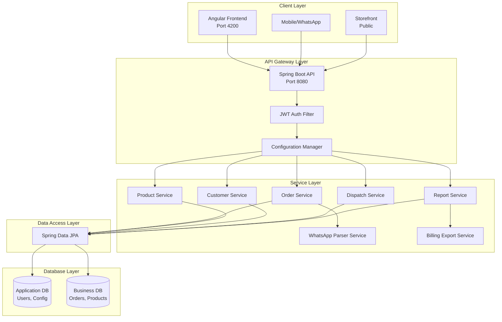
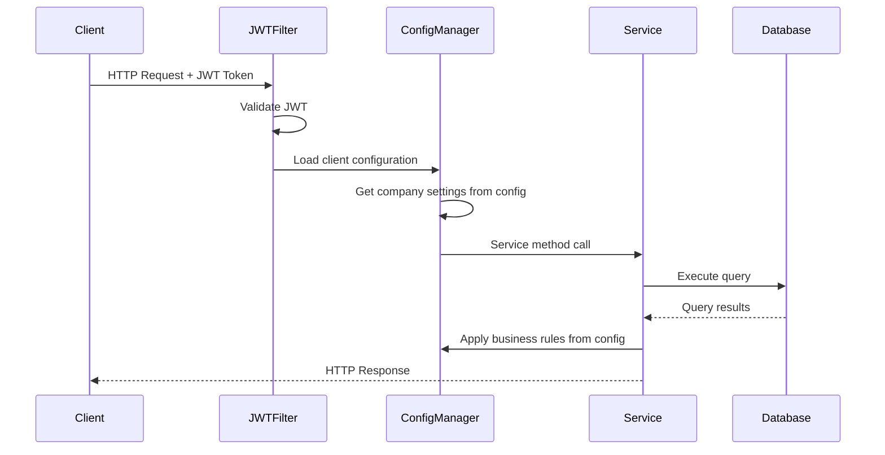
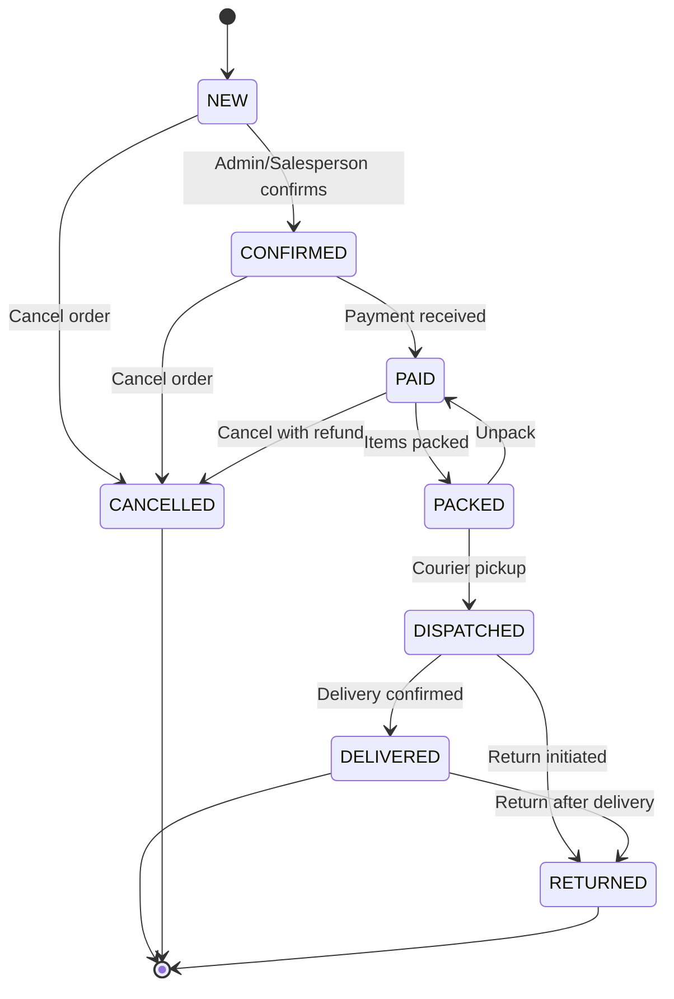
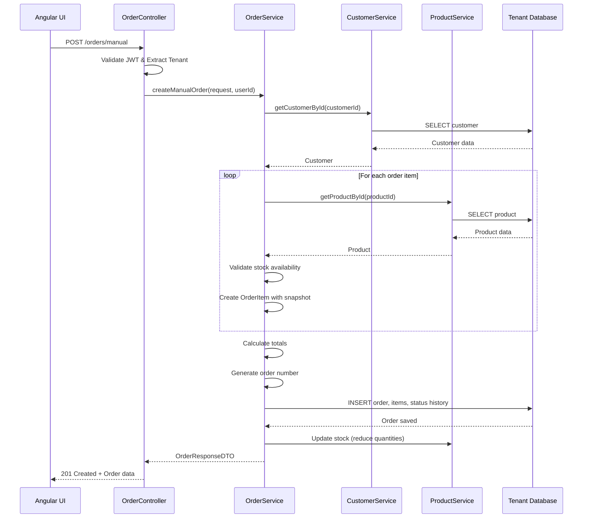
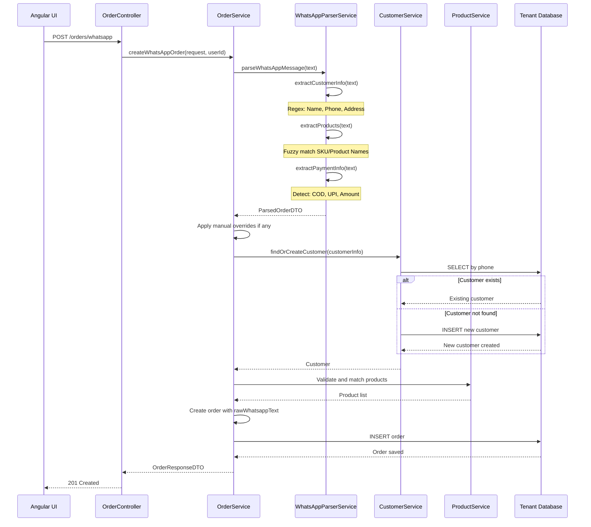
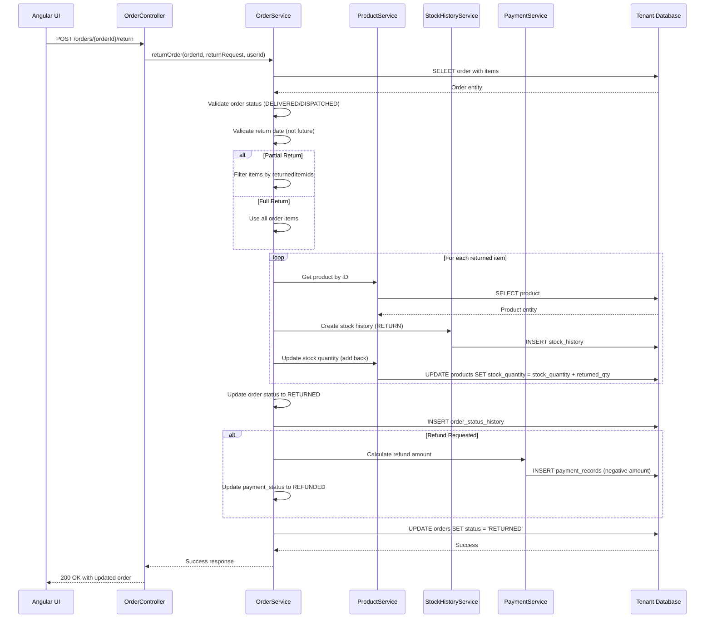
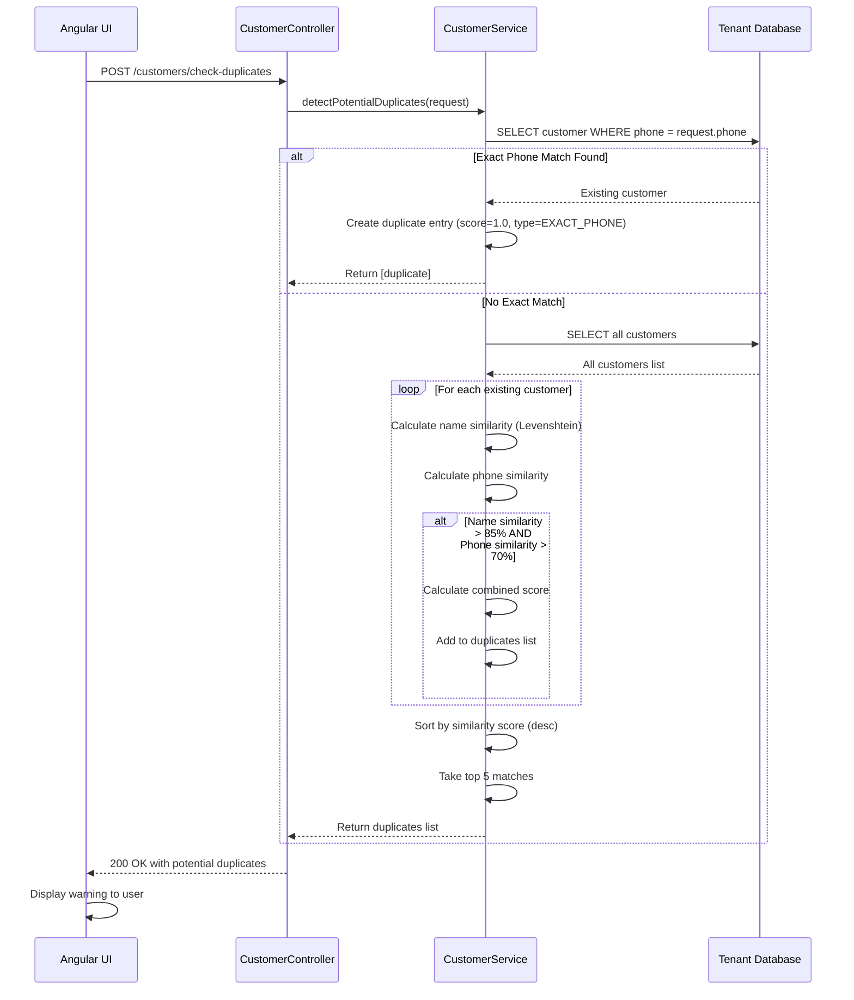

# Design Document: Ayurveda Order & Dispatch Management System

## Overview

The Ayurveda Order & Dispatch Management System is a comprehensive single-client application designed for Ayurvedic product vendors to manage end-to-end order lifecycle from order entry through dispatch and billing. Built using Java Spring Boot backend, Angular frontend, and MySQL database with configuration-based client settings.

The system supports three primary user roles (Admin, Accountant, Salesperson) with role-based access control, enabling manual and automated order entry (including WhatsApp text parsing), product management with stock tracking, complete order status workflow (NEW → CONFIRMED → PAID → PACKED → DISPATCHED → DELIVERED), dispatch label generation, comprehensive reporting, and billing export capabilities compatible with Vyapar billing software.

Key architectural principles include: configuration-driven client setup (company name, branding, business rules), JWT-based authentication, RESTful API design, event-driven status transitions with audit trails, and extensibility for future integrations (WhatsApp API, Courier APIs, GST invoicing). The application can be deployed for different clients by modifying configuration files without code changes.

## Architecture

### System Architecture Overview



### Configuration-Based Architecture



## Components and Interfaces

### 1. Order Management Component

**Purpose**: Core component for managing the complete order lifecycle from creation through delivery

**Interface**:
```java
public interface OrderManagementService {
    // Order Creation
    OrderResponseDTO createManualOrder(ManualOrderRequestDTO request, Long userId);
    OrderResponseDTO createWhatsAppOrder(WhatsAppOrderRequestDTO request, Long userId);
    OrderResponseDTO createStorefrontOrder(StorefrontOrderRequestDTO request);
    
    // Order Retrieval
    OrderResponseDTO getOrderById(Long orderId);
    OrderResponseDTO getOrderByNumber(String orderNumber);
    PagedResultDTO<OrderResponseDTO> getAllOrders(OrderFilterDTO filter, Pageable pageable);
    PagedResultDTO<OrderResponseDTO> getOrdersBySalesperson(Long salespersonId, LocalDate from, LocalDate to, Pageable pageable);
    
    // Order Update
    OrderResponseDTO updateOrder(Long orderId, UpdateOrderRequestDTO request);
    void updateOrderStatus(Long orderId, OrderStatus newStatus, String notes, Long userId);
    void updatePaymentStatus(Long orderId, PaymentStatus newStatus, PaymentRecordDTO payment);
    
    // Order Operations
    void cancelOrder(Long orderId, String reason, Long userId);
    void returnOrder(Long orderId, ReturnRequestDTO request, Long userId);
    DuplicateCheckResultDTO checkDuplicate(String customerPhone, List<Long> productIds);
    
    // Bulk Operations
    List<OrderResponseDTO> bulkUpdateStatus(List<Long> orderIds, OrderStatus newStatus, Long userId);
}
```

**Responsibilities**:
- Create orders from multiple sources (manual entry, WhatsApp, storefront)
- Manage order status transitions with validation
- Track payment status and history
- Detect duplicate orders based on customer and products
- Maintain order audit trail through OrderStatusHistory

### 2. WhatsApp Parser Component

**Purpose**: Automated extraction of order details from WhatsApp messages

**Interface**:
```java
public interface WhatsAppParserService {
    ParsedOrderDTO parseWhatsAppMessage(String messageText);
    CustomerInfoDTO extractCustomerInfo(String messageText);
    List<ProductLineDTO> extractProducts(String messageText);
    PaymentInfoDTO extractPaymentInfo(String messageText);
    ValidationResultDTO validateParsedData(ParsedOrderDTO parsedOrder);
}
```

**Responsibilities**:
- Parse unstructured WhatsApp text using regex patterns
- Extract customer details (name, phone, address)
- Identify products using fuzzy matching against SKU/product names
- Extract payment information (mode, amount, status)
- Validate parsed data completeness and accuracy

### 3. Product Management Component

**Purpose**: Complete CRUD operations for products with stock management

**Interface**:
```java
public interface ProductManagementService {
    // CRUD Operations
    ProductResponseDTO createProduct(CreateProductRequestDTO request);
    ProductResponseDTO updateProduct(Long productId, UpdateProductRequestDTO request);
    void deleteProduct(Long productId);
    ProductResponseDTO getProductById(Long productId);
    ProductResponseDTO getProductBySku(String sku);
    PagedResultDTO<ProductResponseDTO> getAllProducts(ProductFilterDTO filter, Pageable pageable);
    
    // Stock Management
    void updateStock(Long productId, Integer quantity, StockOperation operation);
    void bulkUpdateStock(List<StockUpdateDTO> updates);
    List<ProductResponseDTO> getLowStockProducts(Integer threshold);
    StockHistoryDTO getStockHistory(Long productId, LocalDate from, LocalDate to);
    
    // Category Management
    List<String> getAllCategories();
    List<ProductResponseDTO> getProductsByCategory(String category);
    
    // Search and Filter
    List<ProductResponseDTO> searchProducts(String query);
    List<ProductResponseDTO> fuzzyMatchProducts(String productName);
}
```

**Responsibilities**:
- Manage product catalog with SKU, MRP, sale price
- Track stock levels and low-stock alerts
- Maintain stock history for audit purposes
- Support fuzzy product matching for WhatsApp parser
- Manage product categories and attributes

### 4. Dispatch Label Component

**Purpose**: Generate dispatch labels in PDF format for single and bulk orders

**Interface**:
```java
public interface DispatchLabelService {
    // Label Generation
    byte[] generateSingleLabel(Long orderId);
    byte[] generateBulkLabels(List<Long> orderIds);
    byte[] generateLabelWithCustomTemplate(Long orderId, String templateId);
    
    // Label Data Preparation
    DispatchLabelDTO prepareLabelData(Long orderId);
    List<DispatchLabelDTO> prepareBulkLabelData(List<Long> orderIds);
    
    // Template Management
    List<LabelTemplateDTO> getAvailableTemplates();
    LabelTemplateDTO getDefaultTemplate();
    
    // Barcode Generation
    String generateOrderBarcode(String orderNumber);
}
```

**Responsibilities**:
- Generate PDF labels with shipping address, product details, barcode
- Support single and bulk label printing
- Include order number, customer details, product list, weight
- Generate barcodes for order tracking
- Support customizable label templates

### 5. Report and Analytics Component

**Purpose**: Comprehensive reporting with daily, monthly, product-wise, state-wise analysis

**Interface**:
```java
public interface ReportService {
    // Sales Reports
    SalesReportDTO getDailySalesReport(LocalDate date);
    SalesReportDTO getMonthlySalesReport(YearMonth month);
    SalesReportDTO getSalespersonSalesReport(Long salespersonId, LocalDate from, LocalDate to);
    
    // Collection Reports
    CollectionReportDTO getDailyCollectionReport(LocalDate date);
    CollectionReportDTO getMonthlyCollectionReport(YearMonth month);
    CollectionReportDTO getSalespersonCollectionReport(Long salespersonId, LocalDate from, LocalDate to);
    
    // Product Reports
    ProductReportDTO getProductWiseSalesReport(LocalDate from, LocalDate to);
    ProductReportDTO getTopSellingProducts(LocalDate from, LocalDate to, Integer limit);
    
    // Geographic Reports
    StateWiseReportDTO getStateWiseSalesReport(LocalDate from, LocalDate to);
    CityWiseReportDTO getCityWiseSalesReport(String state, LocalDate from, LocalDate to);
    
    // Dashboard Metrics
    DashboardMetricsDTO getDashboardMetrics(LocalDate from, LocalDate to);
    List<ChartDataDTO> getSalesChartData(LocalDate from, LocalDate to, ChartGranularity granularity);
    
    // Export Operations
    byte[] exportReportToCSV(ReportType type, ReportFilterDTO filter);
    byte[] exportReportToExcel(ReportType type, ReportFilterDTO filter);
    byte[] exportReportToPDF(ReportType type, ReportFilterDTO filter);
}
```

**Responsibilities**:
- Generate daily and monthly sales reports
- Track salesperson-wise performance
- Provide product-wise and state-wise analytics
- Create dashboard metrics and charts
- Export reports in CSV, Excel, PDF formats

### 6. Billing Export Component

**Purpose**: Export order and invoice data in Vyapar-compatible format

**Interface**:
```java
public interface BillingExportService {
    // Vyapar Export
    byte[] exportToVyaparFormat(List<Long> orderIds);
    byte[] exportDailyOrdersToVyapar(LocalDate date);
    byte[] exportMonthlyOrdersToVyapar(YearMonth month);
    
    // Invoice Generation
    InvoiceDTO prepareInvoiceData(Long orderId);
    byte[] generateInvoicePDF(Long orderId);
    
    // Format Mapping
    VyaparInvoiceDTO mapOrderToVyaparFormat(Order order);
    String formatVyaparCSVLine(Order order);
}
```

**Responsibilities**:
- Map order data to Vyapar billing software format
- Generate CSV/Excel files compatible with Vyapar import
- Prepare invoice data with GST calculations
- Support batch export for multiple orders

### 7. Customer Management Component

**Purpose**: Manage customer information and detect duplicates

**Interface**:
```java
public interface CustomerManagementService {
    // CRUD Operations
    CustomerResponseDTO createCustomer(CreateCustomerRequestDTO request);
    CustomerResponseDTO updateCustomer(Long customerId, UpdateCustomerRequestDTO request);
    void deleteCustomer(Long customerId);
    CustomerResponseDTO getCustomerById(Long customerId);
    Optional<CustomerResponseDTO> getCustomerByPhone(String phone);
    PagedResultDTO<CustomerResponseDTO> getAllCustomers(CustomerFilterDTO filter, Pageable pageable);
    
    // Search Operations
    List<CustomerResponseDTO> searchCustomers(String query);
    CustomerResponseDTO findOrCreateCustomer(CustomerInfoDTO info);
    
    // Duplicate Detection
    List<CustomerResponseDTO> findDuplicatesByPhone(String phone);
    List<CustomerResponseDTO> findSimilarCustomers(String name, String phone);
    List<DuplicateCustomerDTO> detectPotentialDuplicates(CreateCustomerRequestDTO request);
    
    // Customer Analytics
    CustomerOrderHistoryDTO getCustomerOrderHistory(Long customerId);
    CustomerLifetimeMetricsDTO getCustomerLifetimeMetrics(Long customerId);
    BigDecimal getCustomerLifetimeValue(Long customerId);
}
```

**Responsibilities**:
- Manage customer master data
- Detect duplicate customers by phone/name using similarity algorithms
- Auto-create customers from orders with duplicate checking
- Track customer order history, lifetime value, and purchase patterns
- Calculate customer metrics (total orders, average order value, lifetime value)

## Data Models

### Core Entities

#### Order Entity (Enhanced)
```java
@Entity
@Table(name = "orders")
public class Order {
    @Id
    @GeneratedValue(strategy = GenerationType.IDENTITY)
    private Long id;
    
    @Column(unique = true, nullable = false)
    private String orderNumber; // Format: ORD-YYYYMMDD-XXXX
    
    @ManyToOne(fetch = FetchType.LAZY)
    @JoinColumn(name = "customer_id")
    private Customer customer;
    
    @ManyToOne(fetch = FetchType.LAZY)
    @JoinColumn(name = "salesperson_id")
    private Salesperson salesperson;
    
    @Enumerated(EnumType.STRING)
    private OrderSource orderSource; // MANUAL, WHATSAPP, STOREFRONT, API
    
    @Column(columnDefinition = "TEXT")
    private String rawWhatsappText; // Store original WhatsApp message
    
    @Enumerated(EnumType.STRING)
    private OrderStatus status; // NEW, CONFIRMED, PAID, PACKED, DISPATCHED, DELIVERED, CANCELLED, RETURNED
    
    @Enumerated(EnumType.STRING)
    private PaymentStatus paymentStatus; // PENDING, PARTIAL, PAID, REFUNDED
    
    @Enumerated(EnumType.STRING)
    private PaymentMode paymentMode; // COD, UPI, BANK_TRANSFER, ONLINE, CREDIT
    
    private BigDecimal subtotal;
    private BigDecimal discountAmount;
    private BigDecimal taxAmount;
    private BigDecimal shippingCharge;
    private BigDecimal totalAmount;
    
    @OneToMany(mappedBy = "order", cascade = CascadeType.ALL)
    private List<OrderItem> items;
    
    @OneToMany(mappedBy = "order", cascade = CascadeType.ALL)
    private List<OrderStatusHistory> statusHistory;
    
    @OneToMany(mappedBy = "order", cascade = CascadeType.ALL)
    private List<PaymentRecord> paymentRecords;
    
    private LocalDate orderDate;
    private LocalDateTime dispatchedAt;
    private LocalDateTime deliveredAt;
    
    @Column(columnDefinition = "TEXT")
    private String notes;
    
    @CreationTimestamp
    private LocalDateTime createdAt;
    
    @UpdateTimestamp
    private LocalDateTime updatedAt;
}
```

**Validation Rules**:
- `orderNumber` must be unique and follow format ORD-YYYYMMDD-XXXX
- `totalAmount` must equal `subtotal - discountAmount + taxAmount + shippingCharge`
- Status transitions must follow valid workflow (cannot go from DELIVERED to NEW)
- `paymentStatus` must be PAID before status can be set to DISPATCHED
- `customer` must exist in database before order creation
- At least one `OrderItem` must be present

#### PaymentRecord Entity (New)
```java
@Entity
@Table(name = "payment_records")
public class PaymentRecord {
    @Id
    @GeneratedValue(strategy = GenerationType.IDENTITY)
    private Long id;
    
    @ManyToOne(fetch = FetchType.LAZY)
    @JoinColumn(name = "order_id", nullable = false)
    private Order order;
    
    private BigDecimal amount;
    
    @Enumerated(EnumType.STRING)
    private PaymentMode paymentMode;
    
    private String transactionReference; // UTR/Transaction ID
    
    private LocalDateTime paymentDate;
    
    @Column(columnDefinition = "TEXT")
    private String notes;
    
    @Column(nullable = false)
    private Long recordedBy; // User ID who recorded payment
    
    @CreationTimestamp
    private LocalDateTime createdAt;
}
```

**Validation Rules**:
- `amount` must be positive and not exceed remaining order balance
- `paymentMode` is required
- `paymentDate` cannot be in the future
- Sum of all payment records for an order cannot exceed order total

#### OrderStatusHistory Entity (Enhanced)
```java
@Entity
@Table(name = "order_status_history")
public class OrderStatusHistory {
    @Id
    @GeneratedValue(strategy = GenerationType.IDENTITY)
    private Long id;
    
    @ManyToOne(fetch = FetchType.LAZY)
    @JoinColumn(name = "order_id", nullable = false)
    private Order order;
    
    @Enumerated(EnumType.STRING)
    private OrderStatus previousStatus;
    
    @Enumerated(EnumType.STRING)
    private OrderStatus newStatus;
    
    @Column(columnDefinition = "TEXT")
    private String notes;
    
    private Long changedBy; // User ID who made the change
    
    @CreationTimestamp
    private LocalDateTime changedAt;
}
```

#### Salesperson Entity (New)
```java
@Entity
@Table(name = "salespersons")
public class Salesperson {
    @Id
    @GeneratedValue(strategy = GenerationType.IDENTITY)
    private Long id;
    
    @Column(unique = true, nullable = false)
    private String employeeCode;
    
    @Column(nullable = false)
    private String name;
    
    private String phone;
    private String email;
    
    @Enumerated(EnumType.STRING)
    private SalespersonStatus status; // ACTIVE, INACTIVE, ON_LEAVE
    
    private BigDecimal commissionRate; // Percentage
    
    @Column(nullable = false)
    private Long platformUserId; // Link to PlatformUser in master DB
    
    private LocalDate joiningDate;
    
    @CreationTimestamp
    private LocalDateTime createdAt;
    
    @UpdateTimestamp
    private LocalDateTime updatedAt;
}
```

**Validation Rules**:
- `employeeCode` must be unique within tenant
- `commissionRate` must be between 0 and 100
- `platformUserId` must reference existing PlatformUser with role SALESPERSON

#### StockHistory Entity (New)
```java
@Entity
@Table(name = "stock_history")
public class StockHistory {
    @Id
    @GeneratedValue(strategy = GenerationType.IDENTITY)
    private Long id;
    
    @ManyToOne(fetch = FetchType.LAZY)
    @JoinColumn(name = "product_id", nullable = false)
    private Product product;
    
    @Enumerated(EnumType.STRING)
    private StockOperation operation; // STOCK_IN, STOCK_OUT, ADJUSTMENT, RETURN
    
    private Integer quantityBefore;
    private Integer quantityChanged;
    private Integer quantityAfter;
    
    private String referenceType; // ORDER, PURCHASE, ADJUSTMENT
    private Long referenceId; // Order ID or Purchase ID
    
    @Column(columnDefinition = "TEXT")
    private String notes;
    
    private Long performedBy; // User ID
    
    @CreationTimestamp
    private LocalDateTime createdAt;
}
```

### DTO Models

#### ManualOrderRequestDTO
```java
public class ManualOrderRequestDTO {
    @NotNull
    private Long customerId;
    
    private Long salespersonId;
    
    @NotEmpty
    private List<OrderItemDTO> items;
    
    @NotNull
    private PaymentMode paymentMode;
    
    @NotNull
    private PaymentStatus paymentStatus;
    
    private BigDecimal discountAmount;
    private BigDecimal shippingCharge;
    private String notes;
    
    @NotNull
    private LocalDate orderDate;
}
```

#### WhatsAppOrderRequestDTO
```java
public class WhatsAppOrderRequestDTO {
    @NotBlank
    @Size(min = 10, max = 5000)
    private String whatsappText;
    
    private Long salespersonId;
    
    // Optional manual corrections
    private CustomerInfoDTO customerOverride;
    private List<OrderItemDTO> itemsOverride;
    private PaymentInfoDTO paymentOverride;
}
```

#### OrderResponseDTO
```java
public class OrderResponseDTO {
    private Long id;
    private String orderNumber;
    private CustomerResponseDTO customer;
    private SalespersonResponseDTO salesperson;
    private OrderSource orderSource;
    private OrderStatus status;
    private PaymentStatus paymentStatus;
    private PaymentMode paymentMode;
    private BigDecimal subtotal;
    private BigDecimal discountAmount;
    private BigDecimal taxAmount;
    private BigDecimal shippingCharge;
    private BigDecimal totalAmount;
    private BigDecimal paidAmount;
    private BigDecimal remainingAmount;
    private List<OrderItemResponseDTO> items;
    private List<OrderStatusHistoryDTO> statusHistory;
    private List<PaymentRecordDTO> paymentRecords;
    private LocalDate orderDate;
    private LocalDateTime dispatchedAt;
    private LocalDateTime deliveredAt;
    private String notes;
    private LocalDateTime createdAt;
    private LocalDateTime updatedAt;
}
```

#### DispatchLabelDTO
```java
public class DispatchLabelDTO {
    private String orderNumber;
    private LocalDate orderDate;
    
    // Customer/Shipping Info
    private String customerName;
    private String shippingAddress;
    private String city;
    private String state;
    private String pincode;
    private String phone;
    
    // Product Info
    private List<LabelProductLineDTO> products;
    private Integer totalItems;
    private BigDecimal totalWeight;
    
    // Order Info
    private BigDecimal orderAmount;
    private PaymentMode paymentMode;
    private String barcode; // Generated barcode string
    
    // Vendor Info
    private String vendorName;
    private String vendorAddress;
    private String vendorPhone;
}
```

#### ParsedOrderDTO
```java
public class ParsedOrderDTO {
    private CustomerInfoDTO customer;
    private List<ProductLineDTO> products;
    private PaymentInfoDTO payment;
    private String notes;
    private Double confidenceScore; // 0.0 to 1.0
    private List<String> warnings; // Parsing issues/ambiguities
}
```

#### CustomerOrderHistoryDTO
```java
public class CustomerOrderHistoryDTO {
    private Long customerId;
    private String customerName;
    private String phone;
    private String email;
    private List<OrderSummaryDTO> orders;
    private Integer totalOrders;
    private Integer deliveredOrders;
    private Integer cancelledOrders;
    private Integer returnedOrders;
    private BigDecimal totalAmountSpent;
    private BigDecimal averageOrderValue;
    private LocalDate firstOrderDate;
    private LocalDate lastOrderDate;
}
```

#### CustomerLifetimeMetricsDTO
```java
public class CustomerLifetimeMetricsDTO {
    private Long customerId;
    private String customerName;
    private String phone;
    private Integer totalOrders;
    private Integer deliveredOrders;
    private Integer cancelledOrders;
    private Integer returnedOrders;
    private BigDecimal lifetimeValue; // Sum of delivered order totals
    private BigDecimal averageOrderValue;
    private Integer daysSinceFirstOrder;
    private Integer daysSinceLastOrder;
    private List<ProductSummaryDTO> topPurchasedProducts;
    private String customerSegment; // NEW, REGULAR, VIP, DORMANT
}
```

#### DuplicateCustomerDTO
```java
public class DuplicateCustomerDTO {
    private Long customerId;
    private String name;
    private String phone;
    private String email;
    private String address;
    private Double similarityScore; // 0.0 to 1.0
    private String matchType; // EXACT_PHONE, SIMILAR_NAME, SIMILAR_ADDRESS
    private String matchReason; // Description of why flagged as duplicate
}
```

#### ReturnRequestDTO
```java
public class ReturnRequestDTO {
    @NotBlank
    private String returnReason;
    
    private List<Long> returnedItemIds; // Partial returns supported
    
    @NotNull
    private LocalDate returnDate;
    
    private String customerComments;
    private Boolean refundRequested;
    private String refundMode; // Same as payment mode or different
}
```

#### InvoiceDTO
```java
public class InvoiceDTO {
    private String invoiceNumber;
    private LocalDate invoiceDate;
    
    // Vendor Details
    private String vendorName;
    private String vendorGSTIN;
    private String vendorAddress;
    private String vendorPhone;
    private String vendorEmail;
    
    // Customer Details
    private String customerName;
    private String customerGSTIN; // Optional for B2B
    private String billingAddress;
    private String shippingAddress;
    private String customerPhone;
    private String customerEmail;
    
    // Order Details
    private String orderNumber;
    private LocalDate orderDate;
    private List<InvoiceItemDTO> items;
    
    // Financial Details
    private BigDecimal subtotal;
    private BigDecimal discountAmount;
    private BigDecimal taxableAmount;
    private BigDecimal cgstAmount;
    private BigDecimal sgstAmount;
    private BigDecimal igstAmount;
    private BigDecimal totalTax;
    private BigDecimal shippingCharge;
    private BigDecimal totalAmount;
    
    // Payment Details
    private PaymentStatus paymentStatus;
    private BigDecimal paidAmount;
    private BigDecimal balanceAmount;
    
    // Terms and Conditions
    private List<String> termsAndConditions;
    private String bankDetails;
}
```

#### InvoiceItemDTO
```java
public class InvoiceItemDTO {
    private String productName;
    private String sku;
    private String hsnCode; // For GST
    private Integer quantity;
    private String unit; // PCS, KG, LTR
    private BigDecimal unitPrice;
    private BigDecimal discountPercentage;
    private BigDecimal discountAmount;
    private BigDecimal taxableAmount;
    private BigDecimal gstRate;
    private BigDecimal gstAmount;
    private BigDecimal totalAmount;
}
```

## Main Algorithm/Workflow

### Order Status Workflow



### Order Creation Flow (Manual Entry)



### WhatsApp Order Processing Flow



### Order Return Processing Flow



### Customer Duplicate Detection Flow



## Key Functions with Formal Specifications

### Function 1: parseWhatsAppMessage()

```java
/**
 * Parses WhatsApp message text to extract order details
 */
public ParsedOrderDTO parseWhatsAppMessage(String messageText) {
    // Implementation
}
```

**Preconditions:**
- `messageText` is non-null and non-empty
- `messageText` length is between 10 and 5000 characters

**Postconditions:**
- Returns valid `ParsedOrderDTO` with confidence score between 0.0 and 1.0
- If customer info found: `result.customer` is non-null with at least name OR phone
- If products found: `result.products` contains at least one product line
- If parsing issues detected: `result.warnings` contains descriptive messages
- No modifications to input `messageText`

**Loop Invariants:** N/A (uses regex matching, no explicit loops in signature)

### Function 2: updateOrderStatus()

```java
/**
 * Updates order status with validation and audit trail
 */
public void updateOrderStatus(Long orderId, OrderStatus newStatus, String notes, Long userId) 
        throws InvalidStatusTransitionException {
    // Implementation
}
```

**Preconditions:**
- `orderId` references existing order in tenant database
- `newStatus` is valid OrderStatus enum value
- `userId` references user with permission to update orders
- Status transition from current status to `newStatus` is valid per workflow rules

**Postconditions:**
- Order status is updated to `newStatus`
- New `OrderStatusHistory` record created with timestamp, user ID, and notes
- If transition to DISPATCHED: `order.dispatchedAt` is set to current timestamp
- If transition to DELIVERED: `order.deliveredAt` is set to current timestamp
- If transition requires payment: `paymentStatus` must be PAID
- Exception thrown if preconditions violated (no partial updates)

**Loop Invariants:** N/A (single operation, no loops)

### Function 3: calculateOrderTotals()

```java
/**
 * Recalculates order totals from line items and adjustments
 */
public void calculateOrderTotals(Order order) {
    // Implementation
}
```

**Preconditions:**
- `order` is non-null
- `order.items` is non-null (may be empty list)
- Each `OrderItem` has valid `lineTotal` calculated

**Postconditions:**
- `order.subtotal` = sum of all `item.lineTotal` values
- `order.totalAmount` = `subtotal - discountAmount + taxAmount + shippingCharge`
- If `order.items` is empty: `subtotal = 0` and `totalAmount = 0 + taxAmount + shippingCharge - discountAmount`
- All BigDecimal calculations maintain precision of 2 decimal places
- No side effects beyond updating order's total fields

**Loop Invariants:**
- For summation loop: accumulated subtotal never exceeds sum of remaining items + current subtotal
- All intermediate calculations maintain non-negative values (given valid input)

### Function 4: checkDuplicateOrder()

```java
/**
 * Detects potential duplicate orders based on customer and products
 */
public DuplicateCheckResultDTO checkDuplicate(String customerPhone, List<Long> productIds, 
                                               LocalDate orderDate) {
    // Implementation
}
```

**Preconditions:**
- `customerPhone` is non-null and matches valid phone format
- `productIds` is non-null and non-empty list
- `orderDate` is non-null

**Postconditions:**
- Returns `DuplicateCheckResultDTO` with `isDuplicate` boolean flag
- If duplicates found: `potentialDuplicates` list contains matching orders within 7 days
- Duplicate criteria: same customer phone + 80% product overlap + within 7 days of `orderDate`
- If no duplicates: `potentialDuplicates` is empty list
- No modifications to database state

**Loop Invariants:**
- For product comparison loop: all previously compared products maintain their match status
- Duplicate score accumulates correctly (0.0 to 1.0 range maintained)

### Function 5: generateDispatchLabel()

```java
/**
 * Generates PDF dispatch label for order
 */
public byte[] generateDispatchLabel(Long orderId) throws OrderNotFoundException {
    // Implementation
}
```

**Preconditions:**
- `orderId` references existing order
- Order has valid customer with shipping address
- Order has at least one order item
- Order status is PAID or later in workflow

**Postconditions:**
- Returns non-null byte array containing valid PDF data
- PDF contains: order number, customer name/address, product list, barcode
- Barcode encodes order number in Code128 format
- PDF size is reasonable (< 500KB for single label)
- No modifications to order state

**Loop Invariants:**
- For product line rendering: all previously rendered products appear in correct order
- PDF page dimensions remain consistent throughout generation

## Algorithmic Pseudocode

### WhatsApp Message Parsing Algorithm

```java
/**
 * Algorithm: Parse WhatsApp message to extract order details
 * Input: messageText (String) - Raw WhatsApp message
 * Output: ParsedOrderDTO - Structured order data
 */
public ParsedOrderDTO parseWhatsAppMessage(String messageText) {
    // Precondition checks
    if (messageText == null || messageText.trim().isEmpty()) {
        throw new IllegalArgumentException("Message text cannot be empty");
    }
    if (messageText.length() > 5000) {
        throw new IllegalArgumentException("Message text too long");
    }
    
    ParsedOrderDTO result = new ParsedOrderDTO();
    List<String> warnings = new ArrayList<>();
    double confidenceScore = 1.0;
    
    // Step 1: Extract customer information
    CustomerInfoDTO customer = extractCustomerInfo(messageText);
    if (customer.getName() == null && customer.getPhone() == null) {
        warnings.add("No customer information found");
        confidenceScore -= 0.3;
    }
    result.setCustomer(customer);
    
    // Step 2: Extract product lines
    List<ProductLineDTO> products = extractProducts(messageText);
    if (products.isEmpty()) {
        warnings.add("No products identified in message");
        confidenceScore -= 0.4;
    } else {
        // Validate each product against database
        for (ProductLineDTO product : products) {
            if (product.getMatchConfidence() < 0.7) {
                warnings.add("Low confidence match for: " + product.getProductName());
                confidenceScore -= 0.1;
            }
        }
    }
    result.setProducts(products);
    
    // Step 3: Extract payment information
    PaymentInfoDTO payment = extractPaymentInfo(messageText);
    if (payment.getPaymentMode() == null) {
        warnings.add("Payment mode not detected, defaulting to COD");
        payment.setPaymentMode(PaymentMode.COD);
        confidenceScore -= 0.2;
    }
    result.setPayment(payment);
    
    // Step 4: Extract notes/special instructions
    String notes = extractNotes(messageText);
    result.setNotes(notes);
    
    // Ensure confidence score is within bounds
    result.setConfidenceScore(Math.max(0.0, Math.min(1.0, confidenceScore)));
    result.setWarnings(warnings);
    
    return result;
}

/**
 * Helper: Extract customer information using regex patterns
 */
private CustomerInfoDTO extractCustomerInfo(String text) {
    CustomerInfoDTO customer = new CustomerInfoDTO();
    
    // Pattern 1: Name on separate line or after "Name:"
    Pattern namePattern = Pattern.compile(
        "(?:Name|Customer|From)[:\\s]+([A-Za-z\\s]{3,50})",
        Pattern.CASE_INSENSITIVE
    );
    Matcher nameMatcher = namePattern.matcher(text);
    if (nameMatcher.find()) {
        customer.setName(nameMatcher.group(1).trim());
    }
    
    // Pattern 2: Indian phone number (10 digits with optional +91/0 prefix)
    Pattern phonePattern = Pattern.compile(
        "(?:\\+91|0)?[6-9]\\d{9}"
    );
    Matcher phoneMatcher = phonePattern.matcher(text);
    if (phoneMatcher.find()) {
        String phone = phoneMatcher.group().replaceAll("\\D", "");
        if (phone.length() > 10) {
            phone = phone.substring(phone.length() - 10);
        }
        customer.setPhone(phone);
    }
    
    // Pattern 3: Address (usually multi-line, capture until pincode)
    Pattern addressPattern = Pattern.compile(
        "(?:Address|Ship\\s*to)[:\\s]+(.+?)(?=\\n|$|Pin|\\d{6})",
        Pattern.CASE_INSENSITIVE | Pattern.DOTALL
    );
    Matcher addressMatcher = addressPattern.matcher(text);
    if (addressMatcher.find()) {
        customer.setAddress(addressMatcher.group(1).trim());
    }
    
    // Pattern 4: Pincode (6 digits)
    Pattern pincodePattern = Pattern.compile("\\b\\d{6}\\b");
    Matcher pincodeMatcher = pincodePattern.matcher(text);
    if (pincodeMatcher.find()) {
        customer.setPincode(pincodeMatcher.group());
    }
    
    return customer;
}

/**
 * Helper: Extract product lines with fuzzy matching
 */
private List<ProductLineDTO> extractProducts(String text) {
    List<ProductLineDTO> products = new ArrayList<>();
    
    // Pattern: Product lines (SKU or name followed by quantity)
    // Examples: "ABC123 x 2", "Ashwagandha Capsules - 3", "Product Name 5"
    Pattern productPattern = Pattern.compile(
        "([A-Za-z0-9\\s-]+?)\\s*[x×:-]?\\s*(\\d+)",
        Pattern.MULTILINE
    );
    Matcher productMatcher = productPattern.matcher(text);
    
    while (productMatcher.find()) {
        String productIdentifier = productMatcher.group(1).trim();
        int quantity = Integer.parseInt(productMatcher.group(2));
        
        // Fuzzy match against product database
        Product matchedProduct = fuzzyMatchProduct(productIdentifier);
        
        if (matchedProduct != null) {
            ProductLineDTO line = new ProductLineDTO();
            line.setProductId(matchedProduct.getId());
            line.setProductName(matchedProduct.getName());
            line.setSku(matchedProduct.getSku());
            line.setQuantity(quantity);
            line.setUnitPrice(matchedProduct.getSalePrice());
            line.setMatchConfidence(calculateMatchConfidence(productIdentifier, matchedProduct));
            products.add(line);
        }
    }
    
    return products;
}

/**
 * Helper: Fuzzy match product identifier against database
 */
private Product fuzzyMatchProduct(String identifier) {
    // Try exact SKU match first
    Optional<Product> exactMatch = productRepository.findBySku(identifier);
    if (exactMatch.isPresent()) {
        return exactMatch.get();
    }
    
    // Fuzzy match by name using Levenshtein distance
    List<Product> allProducts = productRepository.findAll();
    Product bestMatch = null;
    double bestScore = 0.0;
    
    for (Product product : allProducts) {
        double nameScore = calculateSimilarity(identifier, product.getName());
        double skuScore = calculateSimilarity(identifier, product.getSku());
        double maxScore = Math.max(nameScore, skuScore);
        
        if (maxScore > bestScore && maxScore > 0.6) { // 60% threshold
            bestScore = maxScore;
            bestMatch = product;
        }
    }
    
    return bestMatch;
}
```

**Preconditions:**
- Input text is validated (non-null, length within limits)
- Product database is accessible and contains active products

**Postconditions:**
- Returns structured ParsedOrderDTO with confidence score
- All regex patterns are compiled and executed safely
- Fuzzy matching uses consistent similarity threshold (0.6)
- Warnings list contains all parsing issues encountered

**Loop Invariants:**
- Product extraction loop: all previously matched products remain in results list
- Fuzzy matching loop: bestScore never decreases, always between 0.0 and 1.0
- Confidence score adjustments accumulate correctly

### Order Status Transition Validation Algorithm

```java
/**
 * Algorithm: Validate order status transition
 * Input: currentStatus (OrderStatus), newStatus (OrderStatus), order (Order)
 * Output: boolean - true if transition is valid
 */
public boolean isValidStatusTransition(OrderStatus currentStatus, OrderStatus newStatus, Order order) {
    // Define valid transitions as adjacency map
    Map<OrderStatus, Set<OrderStatus>> validTransitions = Map.of(
        OrderStatus.NEW, Set.of(OrderStatus.CONFIRMED, OrderStatus.CANCELLED),
        OrderStatus.CONFIRMED, Set.of(OrderStatus.PAID, OrderStatus.CANCELLED),
        OrderStatus.PAID, Set.of(OrderStatus.PACKED, OrderStatus.CANCELLED),
        OrderStatus.PACKED, Set.of(OrderStatus.DISPATCHED, OrderStatus.PAID),
        OrderStatus.DISPATCHED, Set.of(OrderStatus.DELIVERED, OrderStatus.RETURNED),
        OrderStatus.DELIVERED, Set.of(OrderStatus.RETURNED),
        OrderStatus.CANCELLED, Set.of(), // Terminal state
        OrderStatus.RETURNED, Set.of()   // Terminal state
    );
    
    // Check if transition exists in map
    if (!validTransitions.get(currentStatus).contains(newStatus)) {
        return false;
    }
    
    // Additional business rule validations
    if (newStatus == OrderStatus.DISPATCHED) {
        // Cannot dispatch without payment
        if (order.getPaymentStatus() != PaymentStatus.PAID) {
            return false;
        }
        
        // Cannot dispatch without customer address
        if (order.getCustomer().getAddressLine1() == null || 
            order.getCustomer().getPincode() == null) {
            return false;
        }
    }
    
    if (newStatus == OrderStatus.PACKED) {
        // Verify stock availability for all items
        for (OrderItem item : order.getItems()) {
            Product product = item.getProduct();
            if (product.getStockQuantity() < item.getQuantity()) {
                return false;
            }
        }
    }
    
    return true;
}

/**
 * Algorithm: Update order status with audit trail
 */
@Transactional
public void updateOrderStatus(Long orderId, OrderStatus newStatus, String notes, Long userId) {
    // Step 1: Load order
    Order order = orderRepository.findById(orderId)
        .orElseThrow(() -> new OrderNotFoundException("Order not found: " + orderId));
    
    OrderStatus currentStatus = order.getStatus();
    
    // Step 2: Validate transition
    if (!isValidStatusTransition(currentStatus, newStatus, order)) {
        throw new InvalidStatusTransitionException(
            String.format("Cannot transition from %s to %s", currentStatus, newStatus)
        );
    }
    
    // Step 3: Create audit history record
    OrderStatusHistory history = OrderStatusHistory.builder()
        .order(order)
        .previousStatus(currentStatus)
        .newStatus(newStatus)
        .notes(notes)
        .changedBy(userId)
        .build();
    
    // Step 4: Update order status
    order.setStatus(newStatus);
    
    // Step 5: Handle status-specific actions
    if (newStatus == OrderStatus.DISPATCHED) {
        order.setDispatchedAt(LocalDateTime.now());
    } else if (newStatus == OrderStatus.DELIVERED) {
        order.setDeliveredAt(LocalDateTime.now());
    } else if (newStatus == OrderStatus.PACKED) {
        // Reduce stock for all items
        for (OrderItem item : order.getItems()) {
            productService.updateStock(
                item.getProduct().getId(),
                item.getQuantity(),
                StockOperation.STOCK_OUT
            );
        }
    } else if (newStatus == OrderStatus.CANCELLED || newStatus == OrderStatus.RETURNED) {
        // Restore stock if items were already packed
        if (currentStatus == OrderStatus.PACKED || 
            currentStatus == OrderStatus.DISPATCHED ||
            currentStatus == OrderStatus.DELIVERED) {
            for (OrderItem item : order.getItems()) {
                productService.updateStock(
                    item.getProduct().getId(),
                    item.getQuantity(),
                    StockOperation.RETURN
                );
            }
        }
    }
    
    // Step 6: Save changes
    orderStatusHistoryRepository.save(history);
    orderRepository.save(order);
}
```

**Preconditions:**
- Order with `orderId` exists in database
- `newStatus` is valid OrderStatus enum value
- User with `userId` has permission to update orders
- Transition from current status to `newStatus` is allowed

**Postconditions:**
- Order status updated to `newStatus`
- OrderStatusHistory record created with timestamp and user ID
- Status-specific timestamps updated (dispatchedAt, deliveredAt)
- Stock quantities adjusted based on status transition
- All database operations succeed or transaction rolls back

**Loop Invariants:**
- Stock update loop: all previously processed items have correct stock adjustments
- Stock quantity never becomes negative

### Duplicate Order Detection Algorithm

```java
/**
 * Algorithm: Detect potential duplicate orders
 * Input: customerPhone, productIds, orderDate
 * Output: DuplicateCheckResultDTO with matching orders
 */
public DuplicateCheckResultDTO checkDuplicate(String customerPhone, 
                                               List<Long> productIds, 
                                               LocalDate orderDate) {
    // Step 1: Find recent orders for customer (within 7 days)
    LocalDate startDate = orderDate.minusDays(7);
    LocalDate endDate = orderDate.plusDays(7);
    
    Customer customer = customerRepository.findByPhone(customerPhone)
        .orElse(null);
    
    if (customer == null) {
        // New customer, cannot be duplicate
        return DuplicateCheckResultDTO.builder()
            .isDuplicate(false)
            .potentialDuplicates(Collections.emptyList())
            .build();
    }
    
    List<Order> recentOrders = orderRepository.findByCustomerAndOrderDateBetween(
        customer,
        startDate,
        endDate
    );
    
    if (recentOrders.isEmpty()) {
        return DuplicateCheckResultDTO.builder()
            .isDuplicate(false)
            .potentialDuplicates(Collections.emptyList())
            .build();
    }
    
    // Step 2: Calculate product overlap for each recent order
    List<DuplicateOrderDTO> potentialDuplicates = new ArrayList<>();
    Set<Long> inputProductSet = new HashSet<>(productIds);
    
    for (Order recentOrder : recentOrders) {
        // Extract product IDs from order items
        Set<Long> orderProductSet = recentOrder.getItems().stream()
            .map(item -> item.getProduct().getId())
            .collect(Collectors.toSet());
        
        // Calculate Jaccard similarity: |intersection| / |union|
        Set<Long> intersection = new HashSet<>(inputProductSet);
        intersection.retainAll(orderProductSet);
        
        Set<Long> union = new HashSet<>(inputProductSet);
        union.addAll(orderProductSet);
        
        double similarity = union.isEmpty() ? 0.0 : 
            (double) intersection.size() / union.size();
        
        // Consider duplicate if 80% or more overlap
        if (similarity >= 0.8) {
            DuplicateOrderDTO duplicate = DuplicateOrderDTO.builder()
                .orderId(recentOrder.getId())
                .orderNumber(recentOrder.getOrderNumber())
                .orderDate(recentOrder.getOrderDate())
                .similarityScore(similarity)
                .totalAmount(recentOrder.getTotalAmount())
                .status(recentOrder.getStatus())
                .build();
            potentialDuplicates.add(duplicate);
        }
    }
    
    // Step 3: Build result
    return DuplicateCheckResultDTO.builder()
        .isDuplicate(!potentialDuplicates.isEmpty())
        .potentialDuplicates(potentialDuplicates)
        .build();
}
```

**Preconditions:**
- `customerPhone` is valid phone number format
- `productIds` is non-null and non-empty
- `orderDate` is non-null

**Postconditions:**
- Returns DuplicateCheckResultDTO with isDuplicate flag
- If duplicates found: potentialDuplicates list contains matching orders
- Similarity score calculated using Jaccard index (0.0 to 1.0)
- Orders within 7-day window are considered
- No database modifications

**Loop Invariants:**
- Recent orders loop: all processed orders maintain correct similarity calculation
- Similarity score remains between 0.0 and 1.0
- potentialDuplicates list contains only orders meeting threshold (≥ 0.8)

### Customer Duplicate Detection Algorithm

```java
/**
 * Algorithm: Detect duplicate customers during creation
 * Input: customerRequest (name, phone, email, address)
 * Output: List<DuplicateCustomerDTO> - Potential duplicate customers
 */
public List<DuplicateCustomerDTO> detectPotentialDuplicates(CreateCustomerRequestDTO request) {
    List<DuplicateCustomerDTO> duplicates = new ArrayList<>();
    
    // Step 1: Check for exact phone match
    Optional<Customer> exactPhoneMatch = customerRepository.findByPhone(request.getPhone());
    if (exactPhoneMatch.isPresent()) {
        Customer existing = exactPhoneMatch.get();
        DuplicateCustomerDTO duplicate = DuplicateCustomerDTO.builder()
            .customerId(existing.getId())
            .name(existing.getName())
            .phone(existing.getPhone())
            .email(existing.getEmail())
            .address(existing.getAddress())
            .similarityScore(1.0) // Exact match
            .matchType("EXACT_PHONE")
            .matchReason("Phone number already exists in database")
            .build();
        duplicates.add(duplicate);
        return duplicates; // Exact phone match is definitive
    }
    
    // Step 2: Fuzzy match by name (if phone not found)
    List<Customer> allCustomers = customerRepository.findAll();
    
    for (Customer existing : allCustomers) {
        double nameSimilarity = calculateStringSimilarity(
            request.getName().toLowerCase(), 
            existing.getName().toLowerCase()
        );
        
        // Check for similar name (> 85% match)
        if (nameSimilarity > 0.85) {
            // Additional validation: check if phone digits overlap
            String requestPhone = normalizePhone(request.getPhone());
            String existingPhone = normalizePhone(existing.getPhone());
            
            double phoneSimilarity = calculateStringSimilarity(requestPhone, existingPhone);
            
            if (phoneSimilarity > 0.7) { // Phone partially matches
                double combinedScore = (nameSimilarity * 0.6) + (phoneSimilarity * 0.4);
                
                DuplicateCustomerDTO duplicate = DuplicateCustomerDTO.builder()
                    .customerId(existing.getId())
                    .name(existing.getName())
                    .phone(existing.getPhone())
                    .email(existing.getEmail())
                    .address(existing.getAddress())
                    .similarityScore(combinedScore)
                    .matchType("SIMILAR_NAME")
                    .matchReason(String.format(
                        "Name similarity: %.0f%%, Phone similarity: %.0f%%",
                        nameSimilarity * 100, phoneSimilarity * 100
                    ))
                    .build();
                duplicates.add(duplicate);
            }
        }
    }
    
    // Step 3: Sort by similarity score descending
    duplicates.sort((d1, d2) -> Double.compare(d2.getSimilarityScore(), d1.getSimilarityScore()));
    
    // Return top 5 matches
    return duplicates.stream().limit(5).collect(Collectors.toList());
}

/**
 * Helper: Calculate Levenshtein similarity (0.0 to 1.0)
 */
private double calculateStringSimilarity(String s1, String s2) {
    if (s1.equals(s2)) {
        return 1.0;
    }
    
    int maxLen = Math.max(s1.length(), s2.length());
    if (maxLen == 0) {
        return 1.0;
    }
    
    int distance = LevenshteinDistance.getDefaultInstance().apply(s1, s2);
    return 1.0 - ((double) distance / maxLen);
}
```

**Preconditions:**
- `request` contains at least name or phone
- Customer database is accessible

**Postconditions:**
- Returns list of potential duplicates sorted by similarity score
- Exact phone match returns immediately with 1.0 score
- Fuzzy matches use combined name and phone similarity
- Maximum 5 results returned

**Loop Invariants:**
- Similarity scores remain between 0.0 and 1.0
- Duplicates list maintains descending order by similarity score

### Return Processing Algorithm

```java
/**
 * Algorithm: Process order return with stock restoration
 * Input: orderId, returnRequest (reason, items, date)
 * Output: void (updates order status and stock)
 */
@Transactional
public void returnOrder(Long orderId, ReturnRequestDTO request, Long userId) {
    // Step 1: Load and validate order
    Order order = orderRepository.findById(orderId)
        .orElseThrow(() -> new OrderNotFoundException("Order not found: " + orderId));
    
    OrderStatus currentStatus = order.getStatus();
    
    // Validate: Can only return from DELIVERED or DISPATCHED status
    if (currentStatus != OrderStatus.DELIVERED && currentStatus != OrderStatus.DISPATCHED) {
        throw new InvalidOperationException(
            "Can only return orders with status DELIVERED or DISPATCHED"
        );
    }
    
    // Validate: Return date not in future
    if (request.getReturnDate().isAfter(LocalDate.now())) {
        throw new ValidationException("Return date cannot be in future");
    }
    
    // Step 2: Determine items to return (all or partial)
    List<OrderItem> itemsToReturn;
    if (request.getReturnedItemIds() != null && !request.getReturnedItemIds().isEmpty()) {
        // Partial return
        itemsToReturn = order.getItems().stream()
            .filter(item -> request.getReturnedItemIds().contains(item.getId()))
            .collect(Collectors.toList());
        
        if (itemsToReturn.isEmpty()) {
            throw new ValidationException("No valid items found for return");
        }
    } else {
        // Full return
        itemsToReturn = order.getItems();
    }
    
    // Step 3: Restore stock for returned items
    for (OrderItem item : itemsToReturn) {
        Product product = item.getProduct();
        
        // Create stock history record
        StockHistory stockHistory = StockHistory.builder()
            .product(product)
            .operation(StockOperation.RETURN)
            .quantityBefore(product.getStockQuantity())
            .quantityChanged(item.getQuantity())
            .quantityAfter(product.getStockQuantity() + item.getQuantity())
            .referenceType("ORDER_RETURN")
            .referenceId(orderId)
            .notes("Return from order: " + order.getOrderNumber())
            .performedBy(userId)
            .build();
        
        // Update product stock
        product.setStockQuantity(product.getStockQuantity() + item.getQuantity());
        productRepository.save(product);
        stockHistoryRepository.save(stockHistory);
    }
    
    // Step 4: Update order status to RETURNED
    OrderStatus previousStatus = order.getStatus();
    order.setStatus(OrderStatus.RETURNED);
    order.setReturnedAt(LocalDateTime.now());
    order.setReturnReason(request.getReturnReason());
    
    // Step 5: Create status history record
    OrderStatusHistory history = OrderStatusHistory.builder()
        .order(order)
        .previousStatus(previousStatus)
        .newStatus(OrderStatus.RETURNED)
        .notes(String.format("Return reason: %s. Customer comments: %s", 
            request.getReturnReason(), 
            request.getCustomerComments()))
        .changedBy(userId)
        .build();
    
    // Step 6: Handle refund if requested
    if (request.getRefundRequested() != null && request.getRefundRequested()) {
        // Calculate refund amount based on returned items
        BigDecimal refundAmount = itemsToReturn.stream()
            .map(OrderItem::getLineTotal)
            .reduce(BigDecimal.ZERO, BigDecimal::add);
        
        // Create payment record for refund
        PaymentRecord refund = PaymentRecord.builder()
            .order(order)
            .amount(refundAmount.negate()) // Negative amount for refund
            .paymentMode(PaymentMode.valueOf(request.getRefundMode()))
            .transactionReference("REFUND-" + System.currentTimeMillis())
            .paymentDate(LocalDateTime.now())
            .notes("Refund for return")
            .recordedBy(userId)
            .build();
        
        paymentRecordRepository.save(refund);
        
        // Update payment status
        order.setPaymentStatus(PaymentStatus.REFUNDED);
    }
    
    // Step 7: Save all changes
    orderStatusHistoryRepository.save(history);
    orderRepository.save(order);
}
```

**Preconditions:**
- Order exists and is in DELIVERED or DISPATCHED status
- Return date is not in future
- If partial return: returned item IDs are valid and belong to order
- User has permission to process returns

**Postconditions:**
- Order status changed to RETURNED
- Stock quantities restored for all returned items
- StockHistory records created with RETURN operation
- OrderStatusHistory record created with return details
- If refund requested: PaymentRecord created with negative amount
- All database operations succeed or transaction rolls back

**Loop Invariants:**
- Stock restoration loop: all processed items have correct quantity added back
- Stock quantity never becomes negative after restoration

### Invoice Generation Algorithm

```java
/**
 * Algorithm: Generate invoice data with GST calculations
 * Input: orderId
 * Output: InvoiceDTO with complete invoice details
 */
public InvoiceDTO prepareInvoiceData(Long orderId) {
    // Step 1: Load order with all details
    Order order = orderRepository.findById(orderId)
        .orElseThrow(() -> new OrderNotFoundException("Order not found: " + orderId));
    
    // Validate: Can only generate invoice for PAID or later status
    if (order.getStatus() == OrderStatus.NEW || order.getStatus() == OrderStatus.CONFIRMED) {
        throw new InvalidOperationException("Cannot generate invoice for unpaid orders");
    }
    
    // Step 2: Get tenant/vendor details
    Tenant tenant = getTenantFromContext();
    
    // Step 3: Prepare invoice items with GST calculation
    List<InvoiceItemDTO> invoiceItems = new ArrayList<>();
    BigDecimal subtotal = BigDecimal.ZERO;
    BigDecimal totalTax = BigDecimal.ZERO;
    
    for (OrderItem item : order.getItems()) {
        Product product = item.getProduct();
        
        // Calculate taxable amount after discount
        BigDecimal lineSubtotal = item.getUnitPrice().multiply(BigDecimal.valueOf(item.getQuantity()));
        BigDecimal lineDiscount = item.getDiscount();
        BigDecimal taxableAmount = lineSubtotal.subtract(lineDiscount);
        
        // Calculate GST (assume 12% GST rate for Ayurvedic products)
        BigDecimal gstRate = new BigDecimal("12.00");
        BigDecimal gstAmount = taxableAmount.multiply(gstRate).divide(new BigDecimal("100"), 2, RoundingMode.HALF_UP);
        
        // Determine CGST/SGST vs IGST based on state
        boolean isSameState = order.getCustomer().getState().equalsIgnoreCase(tenant.getState());
        
        InvoiceItemDTO invoiceItem = InvoiceItemDTO.builder()
            .productName(item.getProductNameSnapshot())
            .sku(item.getSkuSnapshot())
            .hsnCode(product.getHsnCode()) // HSN code for GST
            .quantity(item.getQuantity())
            .unit("PCS") // Default unit
            .unitPrice(item.getUnitPrice())
            .discountPercentage(calculateDiscountPercentage(lineSubtotal, lineDiscount))
            .discountAmount(lineDiscount)
            .taxableAmount(taxableAmount)
            .gstRate(gstRate)
            .gstAmount(gstAmount)
            .totalAmount(taxableAmount.add(gstAmount))
            .build();
        
        invoiceItems.add(invoiceItem);
        subtotal = subtotal.add(taxableAmount);
        totalTax = totalTax.add(gstAmount);
    }
    
    // Step 4: Calculate CGST/SGST or IGST
    BigDecimal cgstAmount = BigDecimal.ZERO;
    BigDecimal sgstAmount = BigDecimal.ZERO;
    BigDecimal igstAmount = BigDecimal.ZERO;
    
    boolean isSameState = order.getCustomer().getState().equalsIgnoreCase(tenant.getState());
    if (isSameState) {
        // Intra-state: CGST + SGST
        cgstAmount = totalTax.divide(new BigDecimal("2"), 2, RoundingMode.HALF_UP);
        sgstAmount = totalTax.divide(new BigDecimal("2"), 2, RoundingMode.HALF_UP);
    } else {
        // Inter-state: IGST
        igstAmount = totalTax;
    }
    
    // Step 5: Build complete invoice DTO
    InvoiceDTO invoice = InvoiceDTO.builder()
        .invoiceNumber(generateInvoiceNumber(order))
        .invoiceDate(LocalDate.now())
        .vendorName(tenant.getName())
        .vendorGSTIN(tenant.getGstin())
        .vendorAddress(tenant.getAddress())
        .vendorPhone(tenant.getPhone())
        .vendorEmail(tenant.getEmail())
        .customerName(order.getCustomer().getName())
        .customerGSTIN(order.getCustomer().getGstin()) // May be null for B2C
        .billingAddress(order.getCustomer().getAddress())
        .shippingAddress(order.getCustomer().getShippingAddress())
        .customerPhone(order.getCustomer().getPhone())
        .customerEmail(order.getCustomer().getEmail())
        .orderNumber(order.getOrderNumber())
        .orderDate(order.getOrderDate())
        .items(invoiceItems)
        .subtotal(subtotal)
        .discountAmount(order.getDiscountAmount())
        .taxableAmount(subtotal)
        .cgstAmount(cgstAmount)
        .sgstAmount(sgstAmount)
        .igstAmount(igstAmount)
        .totalTax(totalTax)
        .shippingCharge(order.getShippingCharge())
        .totalAmount(order.getTotalAmount())
        .paymentStatus(order.getPaymentStatus())
        .paidAmount(calculateTotalPaid(order))
        .balanceAmount(order.getTotalAmount().subtract(calculateTotalPaid(order)))
        .termsAndConditions(getDefaultTermsAndConditions())
        .bankDetails(tenant.getBankDetails())
        .build();
    
    return invoice;
}

/**
 * Helper: Generate invoice number
 */
private String generateInvoiceNumber(Order order) {
    String datePart = LocalDate.now().format(DateTimeFormatter.ofPattern("yyyyMM"));
    Long sequence = invoiceRepository.countByMonthYear(LocalDate.now());
    return String.format("INV-%s-%04d", datePart, sequence + 1);
}
```

**Preconditions:**
- Order exists and status is PAID or later
- Order has at least one order item
- Tenant/vendor details are configured
- Products have HSN codes for GST

**Postconditions:**
- Returns complete InvoiceDTO with all details
- GST calculated correctly (CGST+SGST for intra-state, IGST for inter-state)
- All monetary values have 2 decimal precision
- Invoice number generated in format INV-YYYYMM-XXXX
- No database modifications (read-only operation)

**Loop Invariants:**
- Invoice items loop: subtotal and totalTax accumulate correctly
- All item-level calculations maintain 2 decimal precision

## REST API Endpoints

### Order Management APIs

#### Create Manual Order
```
POST /api/orders/manual
Authorization: Bearer {jwt_token}
Content-Type: application/json

Request Body: ManualOrderRequestDTO
Response: 201 Created, OrderResponseDTO
```

#### Create WhatsApp Order
```
POST /api/orders/whatsapp
Authorization: Bearer {jwt_token}
Content-Type: application/json

Request Body: WhatsAppOrderRequestDTO
Response: 201 Created, OrderResponseDTO
```

#### Get Order by ID
```
GET /api/orders/{orderId}
Authorization: Bearer {jwt_token}

Response: 200 OK, OrderResponseDTO
```

#### Get All Orders (Paginated with Filters)
```
GET /api/orders?page=0&size=20&status=PAID&salespersonId=5&fromDate=2024-01-01&toDate=2024-12-31
Authorization: Bearer {jwt_token}

Response: 200 OK, Page<OrderResponseDTO>
```

#### Update Order Status
```
PATCH /api/orders/{orderId}/status
Authorization: Bearer {jwt_token}
Content-Type: application/json

Request Body:
{
  "newStatus": "DISPATCHED",
  "notes": "Shipped via BlueDart"
}

Response: 200 OK, OrderResponseDTO
```

#### Update Payment Status
```
PATCH /api/orders/{orderId}/payment
Authorization: Bearer {jwt_token}
Content-Type: application/json

Request Body:
{
  "paymentStatus": "PAID",
  "paymentMode": "UPI",
  "amount": 2500.00,
  "transactionReference": "UTR12345678"
}

Response: 200 OK, OrderResponseDTO
```

#### Check Duplicate Orders
```
POST /api/orders/check-duplicate
Authorization: Bearer {jwt_token}
Content-Type: application/json

Request Body:
{
  "customerPhone": "9876543210",
  "productIds": [1, 2, 3],
  "orderDate": "2024-01-15"
}

Response: 200 OK, DuplicateCheckResultDTO
```

#### Cancel Order
```
POST /api/orders/{orderId}/cancel
Authorization: Bearer {jwt_token}
Content-Type: application/json

Request Body:
{
  "reason": "Customer requested cancellation"
}

Response: 200 OK, OrderResponseDTO
```

### Product Management APIs

#### Create Product
```
POST /api/products
Authorization: Bearer {jwt_token}
Content-Type: application/json

Request Body: CreateProductRequestDTO
Response: 201 Created, ProductResponseDTO
```

#### Update Product
```
PUT /api/products/{productId}
Authorization: Bearer {jwt_token}
Content-Type: application/json

Request Body: UpdateProductRequestDTO
Response: 200 OK, ProductResponseDTO
```

#### Get All Products
```
GET /api/products?page=0&size=20&category=Capsules&search=ashwa
Authorization: Bearer {jwt_token}

Response: 200 OK, Page<ProductResponseDTO>
```

#### Update Stock
```
PATCH /api/products/{productId}/stock
Authorization: Bearer {jwt_token}
Content-Type: application/json

Request Body:
{
  "quantity": 100,
  "operation": "STOCK_IN",
  "notes": "New stock arrival"
}

Response: 200 OK
```

#### Get Low Stock Products
```
GET /api/products/low-stock?threshold=10
Authorization: Bearer {jwt_token}

Response: 200 OK, List<ProductResponseDTO>
```

### Dispatch Label APIs

#### Generate Single Label
```
GET /api/dispatch/labels/{orderId}
Authorization: Bearer {jwt_token}

Response: 200 OK, application/pdf
```

#### Generate Bulk Labels
```
POST /api/dispatch/labels/bulk
Authorization: Bearer {jwt_token}
Content-Type: application/json

Request Body:
{
  "orderIds": [101, 102, 103, 104]
}

Response: 200 OK, application/pdf
```

### Report APIs

#### Get Daily Sales Report
```
GET /api/reports/sales/daily?date=2024-01-15
Authorization: Bearer {jwt_token}

Response: 200 OK, SalesReportDTO
```

#### Get Monthly Sales Report
```
GET /api/reports/sales/monthly?month=2024-01
Authorization: Bearer {jwt_token}

Response: 200 OK, SalesReportDTO
```

#### Get Salesperson Sales Report
```
GET /api/reports/sales/salesperson/{salespersonId}?fromDate=2024-01-01&toDate=2024-01-31
Authorization: Bearer {jwt_token}

Response: 200 OK, SalesReportDTO
```

#### Get Product-wise Report
```
GET /api/reports/products?fromDate=2024-01-01&toDate=2024-01-31
Authorization: Bearer {jwt_token}

Response: 200 OK, ProductReportDTO
```

#### Get State-wise Report
```
GET /api/reports/geographic/state?fromDate=2024-01-01&toDate=2024-01-31
Authorization: Bearer {jwt_token}

Response: 200 OK, StateWiseReportDTO
```

#### Export Report
```
GET /api/reports/export?type=DAILY_SALES&format=CSV&date=2024-01-15
Authorization: Bearer {jwt_token}

Response: 200 OK, application/octet-stream
```

### Billing Export APIs

#### Export to Vyapar Format
```
POST /api/billing/export/vyapar
Authorization: Bearer {jwt_token}
Content-Type: application/json

Request Body:
{
  "orderIds": [101, 102, 103],
  "format": "CSV"
}

Response: 200 OK, application/octet-stream
```

#### Generate Invoice PDF
```
GET /api/billing/invoice/{orderId}
Authorization: Bearer {jwt_token}

Response: 200 OK, application/pdf
```

### Customer Management APIs

#### Search Customers
```
GET /api/customers/search?query=john
Authorization: Bearer {jwt_token}

Response: 200 OK, List<CustomerResponseDTO>
```

#### Get Customer Order History
```
GET /api/customers/{customerId}/orders
Authorization: Bearer {jwt_token}

Response: 200 OK, CustomerOrderHistoryDTO
```

#### Get Customer Lifetime Metrics
```
GET /api/customers/{customerId}/metrics
Authorization: Bearer {jwt_token}

Response: 200 OK, CustomerLifetimeMetricsDTO
```

#### Detect Duplicate Customers
```
POST /api/customers/check-duplicates
Authorization: Bearer {jwt_token}
Content-Type: application/json

Request Body: CreateCustomerRequestDTO
Response: 200 OK, List<DuplicateCustomerDTO>
```

#### Create Customer
```
POST /api/customers
Authorization: Bearer {jwt_token}
Content-Type: application/json

Request Body: CreateCustomerRequestDTO
Response: 201 Created, CustomerResponseDTO
```

#### Update Customer
```
PUT /api/customers/{customerId}
Authorization: Bearer {jwt_token}
Content-Type: application/json

Request Body: UpdateCustomerRequestDTO
Response: 200 OK, CustomerResponseDTO
```

#### Get All Customers (Paginated)
```
GET /api/customers?page=0&size=20&search=john
Authorization: Bearer {jwt_token}

Response: 200 OK, Page<CustomerResponseDTO>
```

### Salesperson Management APIs

#### Create Salesperson
```
POST /api/salespersons
Authorization: Bearer {jwt_token}
Content-Type: application/json

Request Body:
{
  "employeeCode": "SP001",
  "name": "Rajesh Kumar",
  "phone": "9876543210",
  "email": "rajesh@example.com",
  "commissionRate": 5.0,
  "platformUserId": 15,
  "joiningDate": "2024-01-15"
}

Response: 201 Created, SalespersonResponseDTO
```

#### Get All Salespersons
```
GET /api/salespersons?status=ACTIVE
Authorization: Bearer {jwt_token}

Response: 200 OK, List<SalespersonResponseDTO>
```

#### Get Salesperson by ID
```
GET /api/salespersons/{salespersonId}
Authorization: Bearer {jwt_token}

Response: 200 OK, SalespersonResponseDTO
```

#### Update Salesperson
```
PUT /api/salespersons/{salespersonId}
Authorization: Bearer {jwt_token}
Content-Type: application/json

Request Body: UpdateSalespersonRequestDTO
Response: 200 OK, SalespersonResponseDTO
```

#### Get Salesperson Performance
```
GET /api/salespersons/{salespersonId}/performance?fromDate=2024-01-01&toDate=2024-01-31
Authorization: Bearer {jwt_token}

Response: 200 OK, SalespersonPerformanceDTO
```

### Order Return APIs

#### Process Order Return
```
POST /api/orders/{orderId}/return
Authorization: Bearer {jwt_token}
Content-Type: application/json

Request Body: ReturnRequestDTO
Response: 200 OK, OrderResponseDTO
```

#### Get Return History
```
GET /api/orders/returns?fromDate=2024-01-01&toDate=2024-01-31
Authorization: Bearer {jwt_token}

Response: 200 OK, List<OrderResponseDTO>
```

### Invoice APIs

#### Generate Invoice PDF
```
GET /api/billing/invoice/{orderId}
Authorization: Bearer {jwt_token}

Response: 200 OK, application/pdf
```

#### Get Invoice Data
```
GET /api/billing/invoice/{orderId}/data
Authorization: Bearer {jwt_token}

Response: 200 OK, InvoiceDTO
```

#### Bulk Invoice Generation
```
POST /api/billing/invoices/bulk
Authorization: Bearer {jwt_token}
Content-Type: application/json

Request Body:
{
  "orderIds": [101, 102, 103, 104, 105]
}

Response: 200 OK, application/pdf (Combined PDF with all invoices)
```

### Stock History APIs

#### Get Product Stock History
```
GET /api/products/{productId}/stock-history?fromDate=2024-01-01&toDate=2024-01-31
Authorization: Bearer {jwt_token}

Response: 200 OK, List<StockHistoryDTO>
```

#### Get All Stock Movements
```
GET /api/stock-history?operation=STOCK_OUT&fromDate=2024-01-01&toDate=2024-01-31
Authorization: Bearer {jwt_token}

Response: 200 OK, Page<StockHistoryDTO>
```

## Example Usage

### Example 1: Manual Order Creation Flow

```java
// Angular Component
createManualOrder() {
    const orderRequest: ManualOrderRequestDTO = {
        customerId: this.selectedCustomer.id,
        salespersonId: this.currentUser.salespersonId,
        items: [
            {
                productId: 15,
                quantity: 2,
                unitPrice: 450.00,
                discount: 0
            },
            {
                productId: 22,
                quantity: 1,
                unitPrice: 850.00,
                discount: 50.00
            }
        ],
        paymentMode: 'UPI',
        paymentStatus: 'PAID',
        discountAmount: 50.00,
        shippingCharge: 80.00,
        notes: 'Rush delivery requested',
        orderDate: new Date()
    };
    
    this.orderService.createManualOrder(orderRequest).subscribe(
        (order: OrderResponseDTO) => {
            console.log('Order created:', order.orderNumber);
            this.router.navigate(['/orders', order.id]);
        },
        (error) => {
            console.error('Order creation failed:', error);
            this.showErrorMessage(error.message);
        }
    );
}

// Spring Boot Service Implementation
@Service
@Transactional
public class OrderServiceImpl implements OrderManagementService {
    
    @Autowired
    private OrderRepository orderRepository;
    
    @Autowired
    private CustomerService customerService;
    
    @Autowired
    private ProductService productService;
    
    @Override
    public OrderResponseDTO createManualOrder(ManualOrderRequestDTO request, Long userId) {
        // Validate customer
        Customer customer = customerService.getCustomerById(request.getCustomerId());
        
        // Create order entity
        Order order = Order.builder()
            .orderNumber(generateOrderNumber())
            .customer(customer)
            .salespersonId(request.getSalespersonId())
            .orderSource(Order.OrderSource.MANUAL)
            .status(Order.OrderStatus.NEW)
            .paymentMode(request.getPaymentMode())
            .paymentStatus(request.getPaymentStatus())
            .discountAmount(request.getDiscountAmount())
            .shippingCharge(request.getShippingCharge())
            .orderDate(request.getOrderDate())
            .notes(request.getNotes())
            .build();
        
        // Add order items
        for (OrderItemDTO itemDTO : request.getItems()) {
            Product product = productService.getProductById(itemDTO.getProductId());
            
            // Validate stock
            if (product.getStockQuantity() < itemDTO.getQuantity()) {
                throw new InsufficientStockException(
                    "Insufficient stock for product: " + product.getName()
                );
            }
            
            OrderItem item = OrderItem.builder()
                .product(product)
                .productNameSnapshot(product.getName())
                .skuSnapshot(product.getSku())
                .quantity(itemDTO.getQuantity())
                .unitPrice(itemDTO.getUnitPrice())
                .mrpSnapshot(product.getMrp())
                .discount(itemDTO.getDiscount())
                .build();
            
            item.calculateLineTotal();
            order.addItem(item);
        }
        
        // Calculate totals
        order.recalculateTotals();
        
        // Save order
        order = orderRepository.save(order);
        
        // Create status history
        createStatusHistory(order, null, Order.OrderStatus.NEW, "Order created", userId);
        
        return mapToResponseDTO(order);
    }
    
    private String generateOrderNumber() {
        String datePart = LocalDate.now().format(DateTimeFormatter.ofPattern("yyyyMMdd"));
        Long sequence = orderRepository.countByOrderDateBetween(
            LocalDate.now().atStartOfDay(),
            LocalDate.now().atTime(23, 59, 59)
        );
        return String.format("ORD-%s-%04d", datePart, sequence + 1);
    }
}
```

### Example 2: WhatsApp Order Processing

```java
// Sample WhatsApp Message
String whatsappMessage = """
    Name: Rajesh Kumar
    Phone: 9876543210
    Address: 123 MG Road, Bangalore, Karnataka
    Pincode: 560001
    
    Products:
    Ashwagandha Capsules x 2
    Triphala Powder - 3
    Giloy Tablets 1
    
    Payment: UPI Paid 1500
    """;

// Angular Component
processWhatsAppOrder() {
    const request: WhatsAppOrderRequestDTO = {
        whatsappText: this.whatsappTextInput,
        salespersonId: this.currentUser.salespersonId
    };
    
    this.orderService.createWhatsAppOrder(request).subscribe(
        (order: OrderResponseDTO) => {
            if (order.confidenceScore < 0.7) {
                this.showReviewScreen(order);
            } else {
                this.showSuccessMessage(`Order ${order.orderNumber} created successfully`);
                this.router.navigate(['/orders', order.id]);
            }
        }
    );
}

// Spring Boot Service
@Override
public OrderResponseDTO createWhatsAppOrder(WhatsAppOrderRequestDTO request, Long userId) {
    // Parse WhatsApp message
    ParsedOrderDTO parsed = whatsAppParserService.parseWhatsAppMessage(request.getWhatsappText());
    
    // Apply manual overrides if provided
    if (request.getCustomerOverride() != null) {
        parsed.setCustomer(request.getCustomerOverride());
    }
    if (request.getItemsOverride() != null) {
        parsed.setProducts(request.getItemsOverride());
    }
    
    // Find or create customer
    Customer customer = customerService.findOrCreateCustomer(parsed.getCustomer());
    
    // Create order
    Order order = Order.builder()
        .orderNumber(generateOrderNumber())
        .customer(customer)
        .salespersonId(request.getSalespersonId())
        .orderSource(Order.OrderSource.WHATSAPP)
        .rawWhatsappText(request.getWhatsappText())
        .status(Order.OrderStatus.NEW)
        .paymentMode(parsed.getPayment().getPaymentMode())
        .paymentStatus(parsed.getPayment().getPaymentStatus())
        .orderDate(LocalDate.now())
        .build();
    
    // Add items
    for (ProductLineDTO line : parsed.getProducts()) {
        Product product = productService.getProductById(line.getProductId());
        OrderItem item = OrderItem.builder()
            .product(product)
            .productNameSnapshot(product.getName())
            .skuSnapshot(product.getSku())
            .quantity(line.getQuantity())
            .unitPrice(product.getSalePrice())
            .mrpSnapshot(product.getMrp())
            .build();
        item.calculateLineTotal();
        order.addItem(item);
    }
    
    order.recalculateTotals();
    order = orderRepository.save(order);
    
    OrderResponseDTO response = mapToResponseDTO(order);
    response.setConfidenceScore(parsed.getConfidenceScore());
    response.setParsingWarnings(parsed.getWarnings());
    
    return response;
}
```

### Example 3: Order Status Update with Stock Management

```java
// Angular Component
updateOrderStatus(orderId: number, newStatus: string) {
    const updateRequest = {
        newStatus: newStatus,
        notes: this.statusNotes
    };
    
    this.orderService.updateStatus(orderId, updateRequest).subscribe(
        (order) => {
            this.showSuccessMessage(`Order status updated to ${newStatus}`);
            this.loadOrder(orderId);
        },
        (error) => {
            if (error.status === 400) {
                this.showErrorMessage('Invalid status transition');
            } else if (error.status === 409) {
                this.showErrorMessage('Insufficient stock to pack order');
            }
        }
    );
}

// Spring Boot Controller
@PatchMapping("/{orderId}/status")
public ResponseEntity<OrderResponseDTO> updateStatus(
        @PathVariable Long orderId,
        @RequestBody UpdateStatusRequest request,
        @AuthenticationPrincipal UserPrincipal user) {
    
    orderService.updateOrderStatus(orderId, request.getNewStatus(), request.getNotes(), user.getId());
    OrderResponseDTO order = orderService.getOrderById(orderId);
    return ResponseEntity.ok(order);
}
```

### Example 4: Generate Bulk Dispatch Labels

```java
// Angular Component
generateBulkLabels(selectedOrders: number[]) {
    this.dispatchService.generateBulkLabels(selectedOrders).subscribe(
        (pdfBlob: Blob) => {
            const url = window.URL.createObjectURL(pdfBlob);
            const link = document.createElement('a');
            link.href = url;
            link.download = `dispatch-labels-${Date.now()}.pdf`;
            link.click();
            window.URL.revokeObjectURL(url);
        }
    );
}

// Spring Boot Service
@Override
public byte[] generateBulkLabels(List<Long> orderIds) {
    List<DispatchLabelDTO> labels = orderIds.stream()
        .map(this::prepareLabelData)
        .collect(Collectors.toList());
    
    // Use PDF library (e.g., iText or Apache PDFBox)
    ByteArrayOutputStream output = new ByteArrayOutputStream();
    
    try (PDDocument document = new PDDocument()) {
        for (DispatchLabelDTO label : labels) {
            PDPage page = new PDPage(PDRectangle.A4);
            document.addPage(page);
            
            try (PDPageContentStream content = new PDPageContentStream(document, page)) {
                // Header
                content.setFont(PDType1Font.HELVETICA_BOLD, 16);
                content.beginText();
                content.newLineAtOffset(50, 750);
                content.showText("DISPATCH LABEL");
                content.endText();
                
                // Order Number
                content.setFont(PDType1Font.HELVETICA, 12);
                content.beginText();
                content.newLineAtOffset(50, 720);
                content.showText("Order: " + label.getOrderNumber());
                content.endText();
                
                // Customer Details
                content.beginText();
                content.newLineAtOffset(50, 680);
                content.showText("Ship To:");
                content.newLineAtOffset(0, -15);
                content.showText(label.getCustomerName());
                content.newLineAtOffset(0, -15);
                content.showText(label.getShippingAddress());
                content.newLineAtOffset(0, -15);
                content.showText(label.getCity() + ", " + label.getState() + " - " + label.getPincode());
                content.newLineAtOffset(0, -15);
                content.showText("Phone: " + label.getPhone());
                content.endText();
                
                // Products
                int yPos = 600;
                content.beginText();
                content.newLineAtOffset(50, yPos);
                content.showText("Products:");
                content.endText();
                
                yPos -= 20;
                for (LabelProductLineDTO product : label.getProducts()) {
                    content.beginText();
                    content.newLineAtOffset(60, yPos);
                    content.showText(String.format("%s x %d", 
                        product.getProductName(), product.getQuantity()));
                    content.endText();
                    yPos -= 15;
                }
                
                // Barcode (using external library like Barcode4J)
                BufferedImage barcodeImage = generateBarcodeImage(label.getBarcode());
                PDImageXObject pdImage = LosslessFactory.createFromImage(document, barcodeImage);
                content.drawImage(pdImage, 50, 100, 200, 50);
            }
        }
        
        document.save(output);
    } catch (IOException e) {
        throw new PDFGenerationException("Failed to generate labels", e);
    }
    
    return output.toByteArray();
}
```

## Correctness Properties

### Property 1: Order Total Consistency
**For all orders O**:
```
O.totalAmount = O.subtotal - O.discountAmount + O.taxAmount + O.shippingCharge
```
Where:
```
O.subtotal = SUM(item.lineTotal for each item in O.items)
item.lineTotal = (item.quantity × item.unitPrice) - item.discount + item.taxAmount
```

**Validates: Requirements 4.1, 4.2, 4.3, 4.4, 4.5**

### Property 2: Valid Status Transitions
**For all order status updates (currentStatus → newStatus)**:
```
validTransitions(currentStatus, newStatus) = true
```
Where validTransitions is defined by the state machine adjacency rules.

**Additional constraint for DISPATCHED status**:
```
newStatus = DISPATCHED ⟹ paymentStatus = PAID ∧ customer.address ≠ null
```

**Validates: Requirements 5.1, 5.2, 5.3, 5.4, 5.5, 5.6, 5.7, 5.8, 5.9, 5.10, 5.11**

### Property 3: Stock Consistency
**For all products P and orders O**:
```
P.stockQuantity = initialStock - SUM(quantity for packed/dispatched orders) + SUM(quantity for returned orders)
```

**Stock never negative**:
```
∀ Product P: P.stockQuantity ≥ 0
```

**Validates: Requirements 9.2, 9.3, 9.4, 9.6, 25.1, 25.2, 25.3, 25.4**

### Property 4: Payment Balance
**For all orders O**:
```
SUM(paymentRecords.amount) ≤ O.totalAmount
```

**Payment status derivation**:
```
paymentStatus = PAID ⟺ SUM(paymentRecords.amount) = O.totalAmount
paymentStatus = PARTIAL ⟺ 0 < SUM(paymentRecords.amount) < O.totalAmount
paymentStatus = PENDING ⟺ SUM(paymentRecords.amount) = 0
```

**Validates: Requirements 7.1, 7.2, 7.3, 7.4, 7.5, 7.6, 7.7**

### Property 5: Duplicate Detection Accuracy
**For duplicate check D with inputs (customerPhone, productIds, orderDate)**:
```
D.isDuplicate = true ⟺ ∃ Order O where:
  - O.customer.phone = customerPhone
  - |orderDate - O.orderDate| ≤ 7 days
  - jaccardSimilarity(productIds, O.productIds) ≥ 0.8
```

**Validates: Requirements 11.1, 11.2, 11.3, 11.4, 11.5**

### Property 6: Order Number Uniqueness
**For all orders O1, O2**:
```
O1.id ≠ O2.id ⟹ O1.orderNumber ≠ O2.orderNumber
```

**Order number format**:
```
orderNumber matches pattern: "ORD-YYYYMMDD-\d{4}"
```

**Validates: Requirements 2.1, 2.2, 2.3**

### Property 7: Audit Trail Completeness
**For every order status change**:
```
∃ OrderStatusHistory H where:
  - H.order = O
  - H.previousStatus = oldStatus
  - H.newStatus = newStatus
  - H.changedBy = userId
  - H.changedAt = timestamp
```

**Validates: Requirements 6.1, 6.2, 6.3, 32.4**

### Property 8: WhatsApp Parsing Confidence
**For all parsed orders P from WhatsApp**:
```
0.0 ≤ P.confidenceScore ≤ 1.0
```

**Minimum data requirement**:
```
P.confidenceScore > 0.0 ⟹ (P.customer ≠ null ∨ P.products.size() > 0)
```

**Validates: Requirements 3.4, 3.5, 3.6**

### Property 9: Multi-Tenant Data Isolation
**For all database operations in tenant context T**:
```
TenantContext.getCurrentTenant() = T ⟹ 
  RoutingDataSource.determineCurrentLookupKey() = T.databaseKey
```

**No cross-tenant data leakage**:
```
∀ Tenant T1, T2 where T1 ≠ T2:
  query(T1) ∩ query(T2) = ∅
```

**Validates: Requirements 17.1, 17.2, 17.3, 17.4, 17.5**

### Property 10: Stock History Accuracy
**For all stock operations S on product P**:
```
S.quantityAfter = S.quantityBefore + S.quantityChanged (for STOCK_IN, RETURN)
S.quantityAfter = S.quantityBefore - S.quantityChanged (for STOCK_OUT)
```

**Stock history completeness**:
```
∀ Stock change: ∃ StockHistory H where:
  - H.quantityBefore = oldQuantity
  - H.quantityChanged = |newQuantity - oldQuantity|
  - H.quantityAfter = newQuantity
  - H.performedBy = userId
```

**Validates: Requirements 9.6, 21.1, 21.2, 21.3, 21.4**

### Property 11: Return Stock Restoration
**For all returned orders O**:
```
O.status = RETURNED ⟹
  ∀ item ∈ O.items: 
    ∃ StockHistory H where:
      - H.product = item.product
      - H.operation = RETURN
      - H.quantityChanged = item.quantity
      - H.referenceType = "ORDER_RETURN"
      - H.referenceId = O.id
```

**Validates: Requirements 28.1, 28.2, 28.3, 28.4**

### Property 12: Customer Lifetime Value Accuracy
**For all customers C**:
```
C.lifetimeValue = SUM(O.totalAmount for each O where O.customer = C ∧ O.status = DELIVERED)
```

**Customer metrics consistency**:
```
C.totalOrders = COUNT(orders for customer C)
C.averageOrderValue = C.lifetimeValue / C.deliveredOrders (when deliveredOrders > 0)
```

**Validates: Requirements 24.1, 24.2, 24.3**

### Property 13: Duplicate Customer Detection
**For duplicate check D with customer data (name, phone)**:
```
D contains exact match ⟺ ∃ Customer C where C.phone = phone
```

**Fuzzy match accuracy**:
```
D contains fuzzy match ⟺ ∃ Customer C where:
  - levenshteinSimilarity(name, C.name) > 0.85
  - phoneDigitOverlap(phone, C.phone) > 0.7
  - combinedScore ≥ 0.75
```

**Validates: Requirements 10.5, 24.1**

### Property 14: Salesperson Assignment Integrity
**For all orders O with assigned salesperson**:
```
O.salesperson ≠ null ⟹
  - O.salesperson.status = ACTIVE
  - O.salesperson.platformUserId exists in PlatformUser table
```

**Salesperson uniqueness**:
```
∀ Salesperson S1, S2 in same tenant:
  S1.id ≠ S2.id ⟹ S1.employeeCode ≠ S2.employeeCode
```

**Validates: Requirements 20.1, 20.2, 20.3, 20.4, 20.5**

### Property 15: Invoice GST Calculation Correctness
**For all invoices I**:
```
I.taxableAmount = I.subtotal - I.discountAmount
```

**Intra-state GST (same state)**:
```
I.cgstAmount = I.totalTax / 2
I.sgstAmount = I.totalTax / 2
I.igstAmount = 0
```

**Inter-state GST (different states)**:
```
I.igstAmount = I.totalTax
I.cgstAmount = 0
I.sgstAmount = 0
```

**Total amount**:
```
I.totalAmount = I.taxableAmount + I.totalTax + I.shippingCharge
```

**Validates: Requirements 29.1, 29.2, 29.3, 29.4**

### Property 16: Dispatch Label Requirements
**For all dispatch labels L generated for order O**:
```
L can be generated ⟹
  - O.status ∈ {PAID, PACKED, DISPATCHED, DELIVERED}
  - O.customer.address ≠ null
  - O.customer.pincode ≠ null
  - O.items.size() > 0
```

**Label content completeness**:
```
L contains:
  - L.orderNumber = O.orderNumber
  - L.customerName = O.customer.name
  - L.shippingAddress = O.customer.address
  - L.barcode encodes O.orderNumber
  - ∀ item ∈ O.items: item appears in L.products
```

**Validates: Requirements 12.1, 12.2, 12.3, 12.4, 12.5, 12.6, 12.7**

### Property 17: Report Date Filtering Accuracy
**For all reports R with date range [fromDate, toDate]**:
```
∀ Order O in R.results:
  fromDate ≤ O.orderDate ≤ toDate
```

**Sales amount calculation**:
```
R.totalSales = SUM(O.totalAmount for each O where O.status = DELIVERED)
```

**Order count accuracy**:
```
R.totalOrders = COUNT(all orders in date range)
R.deliveredOrders = COUNT(orders where status = DELIVERED)
R.cancelledOrders = COUNT(orders where status = CANCELLED)
```

**Validates: Requirements 13.1, 13.2, 13.3, 13.4, 13.5**

### Property 18: Bulk Operation Atomicity
**For all bulk operations B affecting multiple orders**:
```
B succeeds ⟹ ∀ order ∈ B.orderIds: order.status updated successfully
```

**Partial success handling**:
```
B partially fails ⟹
  - Successfully updated orders have status history records
  - Failed orders remain unchanged
  - Response includes list of successes and failures
```

**Validates: Requirements 23.1, 23.2, 23.3, 23.4**

### Property 19: Phone Number Normalization
**For all phone numbers P in the system**:
```
normalized(P) = last 10 digits of P (removing +91, 0 prefix)
```

**Phone search consistency**:
```
search(P1) finds customer with phone P2 ⟺ normalized(P1) = normalized(P2)
```

**Validates: Requirements 31.1**

### Property 20: Order Source Tracking
**For all orders O**:
```
O.orderSource ∈ {MANUAL, WHATSAPP, STOREFRONT, API}
```

**WhatsApp orders preserve original text**:
```
O.orderSource = WHATSAPP ⟹ O.rawWhatsappText ≠ null
```

**Validates: Requirements 1.1, 1.2, 1.3, 1.6**

## Error Handling

### Error Scenario 1: Insufficient Stock

**Condition**: User attempts to create/pack order when product stock is insufficient

**Response**:
- HTTP 409 Conflict
- Error message: "Insufficient stock for product {productName}. Available: {available}, Required: {required}"
- Order creation/status update is rolled back
- No partial updates to database

**Recovery**:
- User can adjust order quantities
- User can remove out-of-stock items
- System suggests alternative products if available

### Error Scenario 2: Invalid Status Transition

**Condition**: User attempts to transition order status to invalid state (e.g., NEW → DELIVERED)

**Response**:
- HTTP 400 Bad Request
- Error message: "Cannot transition order from {currentStatus} to {newStatus}"
- List of valid transitions provided in error details
- No database changes

**Recovery**:
- User must follow valid status workflow
- System displays available status options based on current state

### Error Scenario 3: Duplicate Order Detected

**Condition**: System detects potential duplicate order during creation

**Response**:
- HTTP 200 OK (order creation proceeds)
- Response includes `duplicateWarning` flag and list of similar orders
- User is notified via UI warning banner

**Recovery**:
- User can review similar orders
- User can proceed with creation or cancel
- User can manually mark order as "not duplicate"

### Error Scenario 4: WhatsApp Parsing Low Confidence

**Condition**: WhatsApp parser returns confidence score < 0.7

**Response**:
- HTTP 200 OK (parsing succeeds)
- Response includes parsed data with warnings
- UI displays review screen with editable fields
- User must verify/correct data before order creation

**Recovery**:
- User reviews parsed customer info, products, payment
- User corrects any errors or fills missing fields
- System submits corrected data for order creation

### Error Scenario 5: Payment Amount Exceeds Order Total

**Condition**: User attempts to record payment that would exceed order total

**Response**:
- HTTP 400 Bad Request
- Error message: "Payment amount {amount} exceeds remaining balance {balance}"
- No payment record created

**Recovery**:
- User adjusts payment amount to remaining balance
- System suggests correct amount in error details

### Error Scenario 6: Tenant Database Connection Failure

**Condition**: AbstractRoutingDataSource cannot connect to tenant database

**Response**:
- HTTP 503 Service Unavailable
- Error message: "Database connection failed for tenant {tenantKey}"
- Request is not processed
- Logged to system monitoring

**Recovery**:
- System retries connection with exponential backoff
- If persistent failure, admin is notified
- User sees "Service temporarily unavailable" message

### Error Scenario 7: Unauthorized Access

**Condition**: User attempts to access order outside their tenant or without permission

**Response**:
- HTTP 403 Forbidden
- Error message: "You do not have permission to access this resource"

**Recovery**:
- User is redirected to login if session expired
- User contacts admin for role/permission changes

## Testing Strategy

### Unit Testing Approach

**Scope**: Test individual service methods, utility functions, and validators in isolation

**Key Test Cases**:

1. **Order Service Tests**:
   - `testCreateManualOrder_Success()` - Valid order creation with stock reduction
   - `testCreateManualOrder_InsufficientStock()` - Should throw exception
   - `testCalculateOrderTotals()` - Verify math accuracy with various discounts/taxes
   - `testGenerateOrderNumber()` - Verify format and uniqueness
   - `testUpdateOrderStatus_ValidTransition()` - Status update succeeds
   - `testUpdateOrderStatus_InvalidTransition()` - Should throw exception
   - `testCancelOrder_StockRestoration()` - Verify stock restored for packed orders

2. **WhatsApp Parser Tests**:
   - `testParseWhatsAppMessage_AllFieldsPresent()` - High confidence score
   - `testParseWhatsAppMessage_MissingCustomerInfo()` - Lower confidence with warnings
   - `testExtractCustomerInfo_ValidFormats()` - Various phone/address formats
   - `testExtractProducts_FuzzyMatch()` - Product name variations
   - `testExtractPaymentInfo_VariousPaymentModes()` - COD, UPI, Bank Transfer detection

3. **Product Service Tests**:
   - `testUpdateStock_StockIn()` - Increase stock correctly
   - `testUpdateStock_StockOut()` - Decrease stock and create history
   - `testUpdateStock_NegativeStock()` - Should throw exception
   - `testFuzzyMatchProduct()` - Levenshtein distance matching

4. **Duplicate Detection Tests**:
   - `testCheckDuplicate_ExactMatch()` - 100% similarity detected
   - `testCheckDuplicate_PartialMatch()` - 80% threshold tested
   - `testCheckDuplicate_OutsideTimeWindow()` - Orders beyond 7 days ignored
   - `testCheckDuplicate_NewCustomer()` - No duplicates for new customers

**Tools**: JUnit 5, Mockito, AssertJ, Spring Boot Test

**Coverage Target**: Minimum 85% line coverage for service layer

### Property-Based Testing Approach

**Property Test Library**: jqwik (Java property-based testing)

**Properties to Test**:

1. **Order Total Calculation Property**:
```java
@Property
void orderTotalAlwaysEqualsSubtotalMinusDiscountPlusTaxPlusShipping(
    @ForAll("validOrderItems") List<OrderItem> items,
    @ForAll @BigRange(min = "0", max = "1000") BigDecimal discount,
    @ForAll @BigRange(min = "0", max = "500") BigDecimal tax,
    @ForAll @BigRange(min = "0", max = "200") BigDecimal shipping) {
    
    Order order = new Order();
    items.forEach(order::addItem);
    order.setDiscountAmount(discount);
    order.setTaxAmount(tax);
    order.setShippingCharge(shipping);
    
    order.recalculateTotals();
    
    BigDecimal expected = order.getSubtotal()
        .subtract(discount)
        .add(tax)
        .add(shipping);
    
    assertThat(order.getTotalAmount()).isEqualTo(expected);
}
```

2. **Status Transition Validity Property**:
```java
@Property
void statusTransitionsMustFollowWorkflowRules(
    @ForAll("validOrderStatuses") OrderStatus currentStatus,
    @ForAll("validOrderStatuses") OrderStatus newStatus) {
    
    Order order = createOrderWithStatus(currentStatus);
    boolean isValid = statusValidator.isValidTransition(currentStatus, newStatus, order);
    
    if (isValid) {
        // Should succeed without exception
        assertDoesNotThrow(() -> orderService.updateOrderStatus(order.getId(), newStatus, "", 1L));
    } else {
        // Should throw exception
        assertThrows(InvalidStatusTransitionException.class,
            () -> orderService.updateOrderStatus(order.getId(), newStatus, "", 1L));
    }
}
```

3. **Payment Balance Property**:
```java
@Property
void totalPaymentRecordsNeverExceedOrderTotal(
    @ForAll @BigRange(min = "100", max = "10000") BigDecimal orderTotal,
    @ForAll("paymentRecordsList") List<PaymentRecord> payments) {
    
    Order order = createOrderWithTotal(orderTotal);
    
    BigDecimal totalPaid = BigDecimal.ZERO;
    for (PaymentRecord payment : payments) {
        if (totalPaid.add(payment.getAmount()).compareTo(orderTotal) <= 0) {
            // Valid payment
            assertDoesNotThrow(() -> orderService.recordPayment(order.getId(), payment));
            totalPaid = totalPaid.add(payment.getAmount());
        } else {
            // Exceeds order total
            assertThrows(PaymentExceedsTotalException.class,
                () -> orderService.recordPayment(order.getId(), payment));
        }
    }
}
```

4. **WhatsApp Parsing Confidence Property**:
```java
@Property
void parserConfidenceScoreAlwaysBetweenZeroAndOne(
    @ForAll("whatsappMessages") String messageText) {
    
    ParsedOrderDTO parsed = whatsAppParser.parseWhatsAppMessage(messageText);
    
    assertThat(parsed.getConfidenceScore()).isBetween(0.0, 1.0);
}
```

### Integration Testing Approach

**Scope**: Test API endpoints with real database (H2 in-memory for tests) and full Spring context

**Key Integration Tests**:

1. **Order Lifecycle Integration Test**:
```java
@SpringBootTest
@AutoConfigureMockMvc
@Transactional
class OrderLifecycleIntegrationTest {
    
    @Autowired
    private MockMvc mockMvc;
    
    @Test
    void completeOrderLifecycle_FromCreationToDelivery() throws Exception {
        // Create order
        String createRequest = """
            {
                "customerId": 1,
                "items": [{"productId": 1, "quantity": 2, "unitPrice": 500}],
                "paymentMode": "UPI",
                "paymentStatus": "PENDING"
            }
            """;
        
        MvcResult createResult = mockMvc.perform(post("/api/orders/manual")
                .contentType(MediaType.APPLICATION_JSON)
                .content(createRequest)
                .header("Authorization", "Bearer " + getTestToken()))
            .andExpect(status().isCreated())
            .andReturn();
        
        Long orderId = extractOrderId(createResult);
        
        // Update to CONFIRMED
        mockMvc.perform(patch("/api/orders/" + orderId + "/status")
                .contentType(MediaType.APPLICATION_JSON)
                .content("{\"newStatus\": \"CONFIRMED\"}")
                .header("Authorization", "Bearer " + getTestToken()))
            .andExpect(status().isOk());
        
        // Record payment
        mockMvc.perform(patch("/api/orders/" + orderId + "/payment")
                .contentType(MediaType.APPLICATION_JSON)
                .content("{\"paymentStatus\": \"PAID\", \"amount\": 1000}")
                .header("Authorization", "Bearer " + getTestToken()))
            .andExpect(status().isOk());
        
        // Update to PACKED (should reduce stock)
        mockMvc.perform(patch("/api/orders/" + orderId + "/status")
                .contentType(MediaType.APPLICATION_JSON)
                .content("{\"newStatus\": \"PACKED\"}")
                .header("Authorization", "Bearer " + getTestToken()))
            .andExpect(status().isOk());
        
        // Verify stock reduced
        mockMvc.perform(get("/api/products/1")
                .header("Authorization", "Bearer " + getTestToken()))
            .andExpect(status().isOk())
            .andExpect(jsonPath("$.stockQuantity").value(98)); // Was 100, reduced by 2
        
        // Dispatch and Deliver
        mockMvc.perform(patch("/api/orders/" + orderId + "/status")
                .contentType(MediaType.APPLICATION_JSON)
                .content("{\"newStatus\": \"DISPATCHED\"}")
                .header("Authorization", "Bearer " + getTestToken()))
            .andExpect(status().isOk())
            .andExpect(jsonPath("$.dispatchedAt").isNotEmpty());
        
        mockMvc.perform(patch("/api/orders/" + orderId + "/status")
                .contentType(MediaType.APPLICATION_JSON)
                .content("{\"newStatus\": \"DELIVERED\"}")
                .header("Authorization", "Bearer " + getTestToken()))
            .andExpect(status().isOk())
            .andExpect(jsonPath("$.deliveredAt").isNotEmpty());
    }
}
```

2. **Multi-Tenant Isolation Test**:
```java
@Test
void tenantDataIsolation_Tenant1CannotAccessTenant2Data() throws Exception {
    // Create order as Tenant 1
    String tenant1Token = getTokenForTenant("shifa");
    MvcResult tenant1Order = mockMvc.perform(post("/api/orders/manual")
            .contentType(MediaType.APPLICATION_JSON)
            .content(createOrderRequest)
            .header("Authorization", "Bearer " + tenant1Token))
        .andExpect(status().isCreated())
        .andReturn();
    
    Long orderId = extractOrderId(tenant1Order);
    
    // Try to access as Tenant 2
    String tenant2Token = getTokenForTenant("vendor-b");
    mockMvc.perform(get("/api/orders/" + orderId)
            .header("Authorization", "Bearer " + tenant2Token))
        .andExpect(status().isNotFound()); // Should not find order from different tenant
}
```

3. **Report Generation Integration Test**:
```java
@Test
void generateDailySalesReport_WithMultipleOrders() throws Exception {
    // Create multiple orders with different statuses
    createTestOrder(1000, OrderStatus.DELIVERED);
    createTestOrder(2000, OrderStatus.DELIVERED);
    createTestOrder(1500, OrderStatus.CANCELLED);
    
    mockMvc.perform(get("/api/reports/sales/daily?date=2024-01-15")
            .header("Authorization", "Bearer " + getTestToken()))
        .andExpect(status().isOk())
        .andExpect(jsonPath("$.totalOrders").value(3))
        .andExpect(jsonPath("$.deliveredOrders").value(2))
        .andExpect(jsonPath("$.totalSales").value(3000)) // Only delivered orders
        .andExpect(jsonPath("$.cancelledOrders").value(1));
}
```

**Tools**: Spring Boot Test, MockMvc, Testcontainers (for MySQL testing), Rest Assured

**Coverage Target**: All critical user flows covered by integration tests

## Performance Considerations

### Database Optimization

1. **Indexing Strategy**:
   - `orders.order_number` - UNIQUE index for fast lookup
   - `orders.customer_id` - Index for customer order history queries
   - `orders.salesperson_id` - Index for salesperson reports
   - `orders.order_date` - Index for date-range queries
   - `orders.status` - Index for status filtering
   - `customers.phone` - UNIQUE index for WhatsApp order matching
   - `products.sku` - UNIQUE index for product lookup
   - `order_status_history.order_id` - Index for audit trail queries

2. **Query Optimization**:
   - Use `@EntityGraph` for eager loading order items to avoid N+1 queries
   - Implement pagination for all list endpoints
   - Use database-level date functions for report aggregations
   - Cache frequently accessed data (product catalog, tenant config)

3. **Connection Pooling**:
   - HikariCP configured per tenant database
   - Pool size: 5-10 connections per tenant (configurable)
   - Connection timeout: 20 seconds
   - Idle timeout: 30 seconds

### Caching Strategy

1. **Application-Level Cache** (Spring Cache with Redis):
   - Product catalog: Cache for 1 hour, invalidate on update
   - Tenant configuration: Cache for 24 hours
   - Customer lookup by phone: Cache for 30 minutes
   - Report data: Cache for 15 minutes with time-based key

2. **Cache Keys**:
   - Product: `tenant:{tenantKey}:product:{productId}`
   - Customer: `tenant:{tenantKey}:customer:phone:{phone}`
   - Report: `tenant:{tenantKey}:report:{type}:{date}`

### Scalability Considerations

1. **Horizontal Scaling**:
   - Stateless API design allows multiple application instances
   - Load balancer distributes requests across instances
   - Shared Redis cache for session management
   - Database connection pooling prevents connection exhaustion

2. **Asynchronous Processing**:
   - Report generation: Use @Async for long-running reports
   - Bulk operations: Process in background with job queue
   - Email notifications: Async with retry mechanism
   - PDF generation: Offload to separate worker service

3. **Batch Operations**:
   - Bulk label generation: Stream processing, not all in memory
   - Report export: Use streaming for large datasets
   - Stock updates: Batch updates in single transaction

### Performance Targets

- API response time: < 200ms (p95) for CRUD operations
- Report generation: < 2 seconds for daily reports
- PDF generation: < 500ms per dispatch label
- Bulk operations: Process 100 orders in < 5 seconds
- Concurrent users: Support 50 concurrent users per tenant
- Database query time: < 100ms for indexed queries

## Security Considerations

### Authentication and Authorization

1. **JWT-Based Authentication**:
   - Access token validity: 24 hours
   - Refresh token validity: 7 days
   - Token includes: userId, tenantKey, role, permissions
   - Token signing algorithm: HS256 with 256-bit secret

2. **Role-Based Access Control**:

| Role | Permissions |
|------|-------------|
| SUPER_ADMIN | All operations across all tenants, tenant management |
| TENANT_ADMIN | All operations within tenant, user management |
| MANAGER | View all orders, create/update orders, generate reports |
| SALESPERSON | Create orders, view own orders, update order status |
| DISPATCHER | View PAID/PACKED orders, update to DISPATCHED, generate labels |
| ACCOUNTANT | View all orders, update payment status, generate billing reports |

3. **API Endpoint Security**:
```java
@Configuration
@EnableWebSecurity
public class SecurityConfig {
    
    @Bean
    public SecurityFilterChain filterChain(HttpSecurity http) throws Exception {
        http
            .authorizeHttpRequests(auth -> auth
                // Public endpoints
                .requestMatchers("/api/auth/**", "/api/storefront/**").permitAll()
                
                // Order endpoints
                .requestMatchers(HttpMethod.POST, "/api/orders/**").hasAnyRole("ADMIN", "MANAGER", "SALESPERSON")
                .requestMatchers(HttpMethod.GET, "/api/orders/**").hasAnyRole("ADMIN", "MANAGER", "SALESPERSON", "DISPATCHER", "ACCOUNTANT")
                .requestMatchers(HttpMethod.PATCH, "/api/orders/*/status").hasAnyRole("ADMIN", "MANAGER", "SALESPERSON", "DISPATCHER")
                .requestMatchers(HttpMethod.PATCH, "/api/orders/*/payment").hasAnyRole("ADMIN", "ACCOUNTANT")
                
                // Product endpoints
                .requestMatchers(HttpMethod.POST, "/api/products").hasAnyRole("ADMIN", "MANAGER")
                .requestMatchers(HttpMethod.PUT, "/api/products/**").hasAnyRole("ADMIN", "MANAGER")
                .requestMatchers(HttpMethod.DELETE, "/api/products/**").hasRole("ADMIN")
                .requestMatchers(HttpMethod.GET, "/api/products/**").authenticated()
                
                // Report endpoints
                .requestMatchers("/api/reports/**").hasAnyRole("ADMIN", "MANAGER", "ACCOUNTANT")
                
                // Dispatch endpoints
                .requestMatchers("/api/dispatch/**").hasAnyRole("ADMIN", "MANAGER", "DISPATCHER")
                
                // Billing endpoints
                .requestMatchers("/api/billing/**").hasAnyRole("ADMIN", "ACCOUNTANT")
                
                .anyRequest().authenticated()
            )
            .addFilterBefore(jwtAuthenticationFilter, UsernamePasswordAuthenticationFilter.class)
            .addFilterAfter(tenantContextFilter, JwtAuthenticationFilter.class);
        
        return http.build();
    }
}
```

### Data Security

1. **Multi-Tenant Isolation**:
   - Database-per-Tenant architecture provides strong isolation
   - Tenant context validation on every request
   - No shared tables between tenants (except master DB)
   - Tenant key embedded in JWT, validated by filter

2. **SQL Injection Prevention**:
   - Use JPA/Hibernate with parameterized queries
   - Never concatenate user input into SQL strings
   - Input validation with Bean Validation (@Valid)

3. **Sensitive Data Protection**:
   - Database credentials encrypted at rest in master DB
   - JWT secret stored in environment variables, not in code
   - Password hashing using BCrypt with salt
   - PII (customer phone, email) encrypted in database (optional)

4. **Audit Logging**:
   - All order status changes logged to `order_status_history`
   - Payment records tracked with user ID and timestamp
   - Failed login attempts logged
   - API access logs with tenant, user, endpoint, timestamp

### Input Validation

1. **Request DTO Validation**:
```java
public class ManualOrderRequestDTO {
    @NotNull(message = "Customer ID is required")
    private Long customerId;
    
    @NotEmpty(message = "Order must have at least one item")
    @Valid
    private List<OrderItemDTO> items;
    
    @NotNull(message = "Payment mode is required")
    private PaymentMode paymentMode;
    
    @DecimalMin(value = "0.0", message = "Discount cannot be negative")
    private BigDecimal discountAmount;
    
    @PastOrPresent(message = "Order date cannot be in the future")
    private LocalDate orderDate;
}
```

2. **Custom Validators**:
   - Phone number format validation (Indian format)
   - SKU format validation (alphanumeric, max 50 chars)
   - Order number format validation
   - Email format validation (RFC 5322)

3. **Sanitization**:
   - HTML content sanitized in notes/description fields
   - WhatsApp text limited to 5000 characters
   - File uploads (images) validated for type and size

### HTTPS and Transport Security

1. **TLS Configuration**:
   - Enforce HTTPS for all API endpoints in production
   - TLS 1.2+ required
   - Redirect HTTP to HTTPS
   - HSTS header enabled

2. **CORS Configuration**:
```java
@Configuration
public class CorsConfig {
    
    @Bean
    public CorsFilter corsFilter() {
        CorsConfiguration config = new CorsConfiguration();
        config.setAllowedOrigins(Arrays.asList("https://shifainfinity.com", "http://localhost:4200"));
        config.setAllowedMethods(Arrays.asList("GET", "POST", "PUT", "PATCH", "DELETE", "OPTIONS"));
        config.setAllowedHeaders(Arrays.asList("Authorization", "Content-Type", "X-Tenant-Key"));
        config.setAllowCredentials(true);
        config.setMaxAge(3600L);
        
        UrlBasedCorsConfigurationSource source = new UrlBasedCorsConfigurationSource();
        source.registerCorsConfiguration("/api/**", config);
        
        return new CorsFilter(source);
    }
}
```

## Dependencies

### Backend Dependencies (Spring Boot)

```xml
<dependencies>
    <!-- Spring Boot Starters -->
    <dependency>
        <groupId>org.springframework.boot</groupId>
        <artifactId>spring-boot-starter-web</artifactId>
    </dependency>
    <dependency>
        <groupId>org.springframework.boot</groupId>
        <artifactId>spring-boot-starter-data-jpa</artifactId>
    </dependency>
    <dependency>
        <groupId>org.springframework.boot</groupId>
        <artifactId>spring-boot-starter-security</artifactId>
    </dependency>
    <dependency>
        <groupId>org.springframework.boot</groupId>
        <artifactId>spring-boot-starter-validation</artifactId>
    </dependency>
    <dependency>
        <groupId>org.springframework.boot</groupId>
        <artifactId>spring-boot-starter-cache</artifactId>
    </dependency>
    
    <!-- Database -->
    <dependency>
        <groupId>mysql</groupId>
        <artifactId>mysql-connector-java</artifactId>
    </dependency>
    <dependency>
        <groupId>com.zaxxer</groupId>
        <artifactId>HikariCP</artifactId>
    </dependency>
    
    <!-- JWT -->
    <dependency>
        <groupId>io.jsonwebtoken</groupId>
        <artifactId>jjwt-api</artifactId>
        <version>0.11.5</version>
    </dependency>
    <dependency>
        <groupId>io.jsonwebtoken</groupId>
        <artifactId>jjwt-impl</artifactId>
        <version>0.11.5</version>
        <scope>runtime</scope>
    </dependency>
    
    <!-- PDF Generation -->
    <dependency>
        <groupId>org.apache.pdfbox</groupId>
        <artifactId>pdfbox</artifactId>
        <version>2.0.29</version>
    </dependency>
    
    <!-- Barcode Generation -->
    <dependency>
        <groupId>net.sourceforge.barbecue</groupId>
        <artifactId>barbecue</artifactId>
        <version>1.5-beta1</version>
    </dependency>
    
    <!-- Excel Export -->
    <dependency>
        <groupId>org.apache.poi</groupId>
        <artifactId>poi-ooxml</artifactId>
        <version>5.2.3</version>
    </dependency>
    
    <!-- CSV Export -->
    <dependency>
        <groupId>com.opencsv</groupId>
        <artifactId>opencsv</artifactId>
        <version>5.7.1</version>
    </dependency>
    
    <!-- String Similarity (for fuzzy matching) -->
    <dependency>
        <groupId>org.apache.commons</groupId>
        <artifactId>commons-text</artifactId>
        <version>1.10.0</version>
    </dependency>
    
    <!-- Caching (Redis) -->
    <dependency>
        <groupId>org.springframework.boot</groupId>
        <artifactId>spring-boot-starter-data-redis</artifactId>
    </dependency>
    
    <!-- Lombok -->
    <dependency>
        <groupId>org.projectlombok</groupId>
        <artifactId>lombok</artifactId>
        <optional>true</optional>
    </dependency>
    
    <!-- Testing -->
    <dependency>
        <groupId>org.springframework.boot</groupId>
        <artifactId>spring-boot-starter-test</artifactId>
        <scope>test</scope>
    </dependency>
    <dependency>
        <groupId>org.springframework.security</groupId>
        <artifactId>spring-security-test</artifactId>
        <scope>test</scope>
    </dependency>
    <dependency>
        <groupId>net.jqwik</groupId>
        <artifactId>jqwik</artifactId>
        <version>1.7.4</version>
        <scope>test</scope>
    </dependency>
</dependencies>
```

### Frontend Dependencies (Angular)

```json
{
  "dependencies": {
    "@angular/core": "^17.0.0",
    "@angular/common": "^17.0.0",
    "@angular/forms": "^17.0.0",
    "@angular/router": "^17.0.0",
    "@angular/platform-browser": "^17.0.0",
    "@angular/material": "^17.0.0",
    "rxjs": "^7.8.0",
    "chart.js": "^4.4.0",
    "ng2-charts": "^5.0.0",
    "ngx-daterangepicker-material": "^6.0.0",
    "file-saver": "^2.0.5",
    "jspdf": "^2.5.1",
    "xlsx": "^0.18.5"
  }
}
```

### External Services (Future Integration)

1. **WhatsApp Business API**:
   - For automated order intake
   - Two-way messaging with customers
   - Order status notifications

2. **Courier Integration APIs**:
   - BlueDart API for shipment tracking
   - Delhivery API for bulk orders
   - India Post API for rural delivery

3. **GST Invoice Service**:
   - E-invoice generation (IRN)
   - E-way bill generation
   - GST return data preparation

4. **SMS Gateway** (optional):
   - Order confirmation SMS
   - Dispatch notifications
   - Payment reminders

5. **Payment Gateway** (optional):
   - Razorpay/PayU for online payments
   - UPI payment collection
   - Payment reconciliation

## Database Schema Enhancements

### New Tables Required

#### 1. salespersons
```sql
CREATE TABLE salespersons (
    id BIGINT PRIMARY KEY AUTO_INCREMENT,
    employee_code VARCHAR(50) UNIQUE NOT NULL,
    name VARCHAR(100) NOT NULL,
    phone VARCHAR(20),
    email VARCHAR(100),
    status ENUM('ACTIVE', 'INACTIVE', 'ON_LEAVE') NOT NULL DEFAULT 'ACTIVE',
    commission_rate DECIMAL(5,2),
    platform_user_id BIGINT NOT NULL,
    joining_date DATE,
    created_at TIMESTAMP DEFAULT CURRENT_TIMESTAMP,
    updated_at TIMESTAMP DEFAULT CURRENT_TIMESTAMP ON UPDATE CURRENT_TIMESTAMP,
    INDEX idx_employee_code (employee_code),
    INDEX idx_status (status)
);
```

#### 2. payment_records
```sql
CREATE TABLE payment_records (
    id BIGINT PRIMARY KEY AUTO_INCREMENT,
    order_id BIGINT NOT NULL,
    amount DECIMAL(12,2) NOT NULL,
    payment_mode ENUM('COD', 'UPI', 'BANK_TRANSFER', 'ONLINE', 'CREDIT') NOT NULL,
    transaction_reference VARCHAR(100),
    payment_date DATETIME NOT NULL,
    notes TEXT,
    recorded_by BIGINT NOT NULL,
    created_at TIMESTAMP DEFAULT CURRENT_TIMESTAMP,
    FOREIGN KEY (order_id) REFERENCES orders(id) ON DELETE CASCADE,
    INDEX idx_order_id (order_id),
    INDEX idx_payment_date (payment_date)
);
```

#### 3. stock_history
```sql
CREATE TABLE stock_history (
    id BIGINT PRIMARY KEY AUTO_INCREMENT,
    product_id BIGINT NOT NULL,
    operation ENUM('STOCK_IN', 'STOCK_OUT', 'ADJUSTMENT', 'RETURN') NOT NULL,
    quantity_before INT NOT NULL,
    quantity_changed INT NOT NULL,
    quantity_after INT NOT NULL,
    reference_type VARCHAR(50),
    reference_id BIGINT,
    notes TEXT,
    performed_by BIGINT NOT NULL,
    created_at TIMESTAMP DEFAULT CURRENT_TIMESTAMP,
    FOREIGN KEY (product_id) REFERENCES products(id) ON DELETE CASCADE,
    INDEX idx_product_id (product_id),
    INDEX idx_created_at (created_at),
    INDEX idx_operation (operation)
);
```

### Modified Tables

#### orders (enhancements)
```sql
ALTER TABLE orders 
ADD COLUMN salesperson_id BIGINT AFTER customer_id,
ADD COLUMN raw_whatsapp_text TEXT AFTER order_source,
ADD INDEX idx_salesperson_id (salesperson_id),
ADD INDEX idx_order_date (order_date),
ADD INDEX idx_status (status),
ADD INDEX idx_payment_status (payment_status);
```

#### order_status_history (enhancements)
```sql
ALTER TABLE order_status_history
ADD COLUMN changed_by BIGINT NOT NULL AFTER notes,
ADD INDEX idx_changed_at (changed_at);
```

## Implementation Roadmap

### Phase 1: Core Order Management (Weeks 1-3)
- Manual order entry with validation
- Order status workflow implementation
- Payment tracking and history
- Stock management integration
- Basic search and filtering

### Phase 2: WhatsApp Integration (Weeks 4-5)
- WhatsApp text parser development
- Regex patterns for extraction
- Fuzzy product matching
- Confidence scoring
- Review/correction UI

### Phase 3: Reporting & Analytics (Weeks 6-7)
- Daily/monthly sales reports
- Salesperson performance tracking
- Product-wise reports
- State/city-wise analytics
- Dashboard with charts

### Phase 4: Dispatch & Billing (Weeks 8-9)
- Dispatch label generation (single/bulk)
- Barcode integration
- Vyapar format export
- Invoice generation
- CSV/Excel/PDF exports

### Phase 5: Advanced Features (Weeks 10-12)
- Duplicate order detection
- Advanced search capabilities
- Role-based access refinement
- Performance optimization
- Security hardening
- Testing and QA

### Phase 6: Future Enhancements (Post-Launch)
- WhatsApp Business API integration
- Courier API integration
- GST invoice automation
- Mobile app development
- Advanced analytics and ML-based insights

## Deployment Architecture

### Production Environment

```
┌─────────────────────────────────────────────────────────────┐
│                     Load Balancer (Nginx)                    │
│                      (SSL Termination)                       │
└───────────────────────┬─────────────────────────────────────┘
                        │
        ┌───────────────┼───────────────┐
        │               │               │
┌───────▼───────┐ ┌────▼──────┐ ┌─────▼────────┐
│ Spring Boot   │ │ Spring    │ │ Spring Boot  │
│ Instance 1    │ │ Boot      │ │ Instance 3   │
│ (Port 8080)   │ │ Instance2 │ │ (Port 8082)  │
└───────┬───────┘ └────┬──────┘ └─────┬────────┘
        │               │               │
        └───────────────┼───────────────┘
                        │
        ┌───────────────┼───────────────┐
        │               │               │
┌───────▼────────┐ ┌───▼───────────┐ ┌▼─────────────┐
│  Master DB     │ │  Tenant DB    │ │  Tenant DB   │
│  (MySQL)       │ │  Shifa        │ │  Vendor B    │
│  Tenant Config │ │  (MySQL)      │ │  (MySQL)     │
└────────────────┘ └───────────────┘ └──────────────┘
```

### Infrastructure Requirements

1. **Application Servers**:
   - 3 instances for high availability
   - 4GB RAM, 2 vCPU each
   - Ubuntu 22.04 LTS

2. **Database Servers**:
   - Master DB: 8GB RAM, 4 vCPU, 100GB SSD
   - Tenant DBs: 4GB RAM, 2 vCPU, 50GB SSD per tenant
   - MySQL 8.0+
   - Automated daily backups

3. **Cache Layer**:
   - Redis 7.0+ standalone or cluster
   - 2GB RAM
   - Persistence enabled

4. **Load Balancer**:
   - Nginx or AWS ALB
   - SSL/TLS termination
   - Health check configuration

5. **Monitoring**:
   - Application logs: ELK Stack or CloudWatch
   - Metrics: Prometheus + Grafana
   - Uptime monitoring: Pingdom or UptimeRobot
   - Error tracking: Sentry

## Conclusion

This comprehensive design provides a robust foundation for the Ayurveda Order & Dispatch Management System. The architecture supports multi-tenancy with strong data isolation, role-based access control, and extensibility for future integrations.

Key design strengths:
- **Database-per-Tenant** ensures maximum security and flexibility
- **Order status workflow** with validation prevents invalid state transitions
- **WhatsApp parser** with confidence scoring enables automated yet reliable order entry
- **Comprehensive reporting** provides actionable insights for business decisions
- **Modular architecture** allows incremental feature development
- **Security-first approach** with JWT, RBAC, and audit trails
- **Performance optimization** through caching, indexing, and async processing

The system is designed to scale from a single tenant (Shifa Ayurveda) to multiple vendors while maintaining performance, security, and maintainability. Future enhancements can be integrated without major architectural changes due to the service-oriented design and clear separation of concerns.
